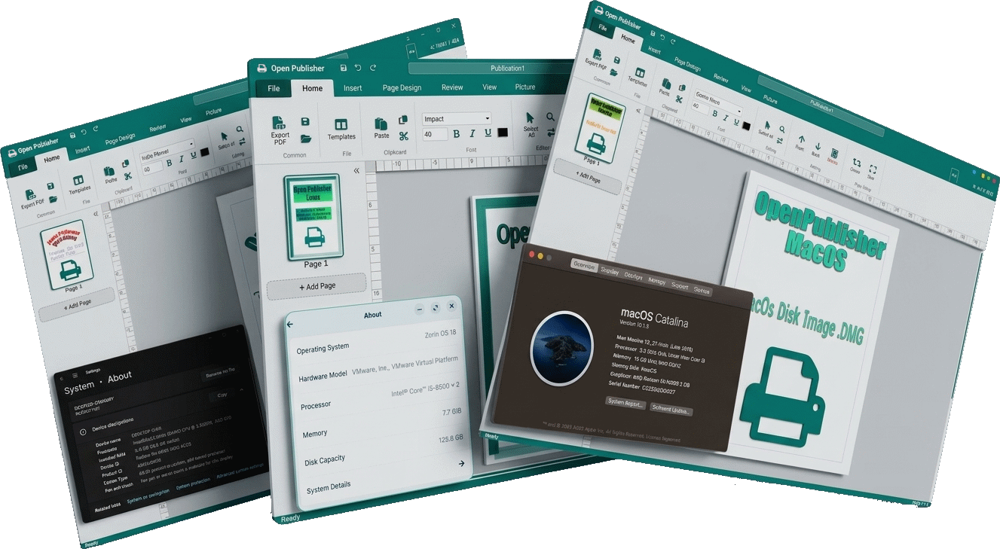
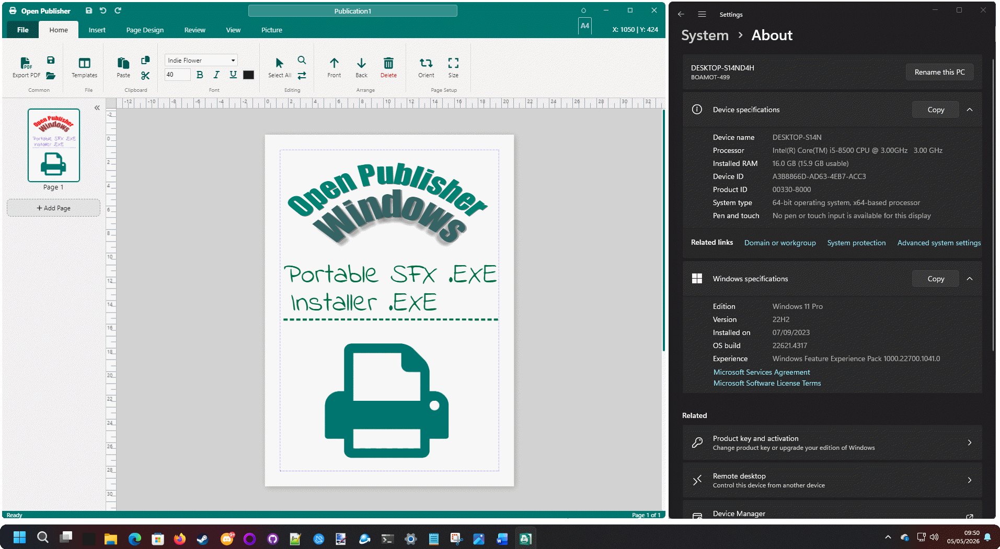
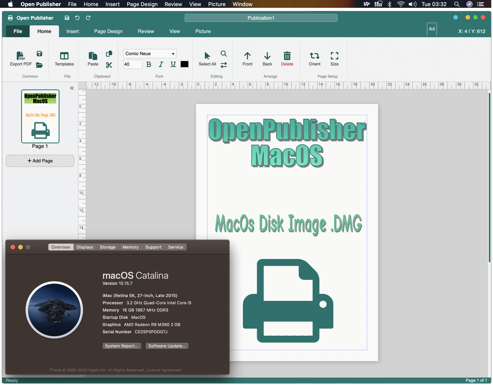
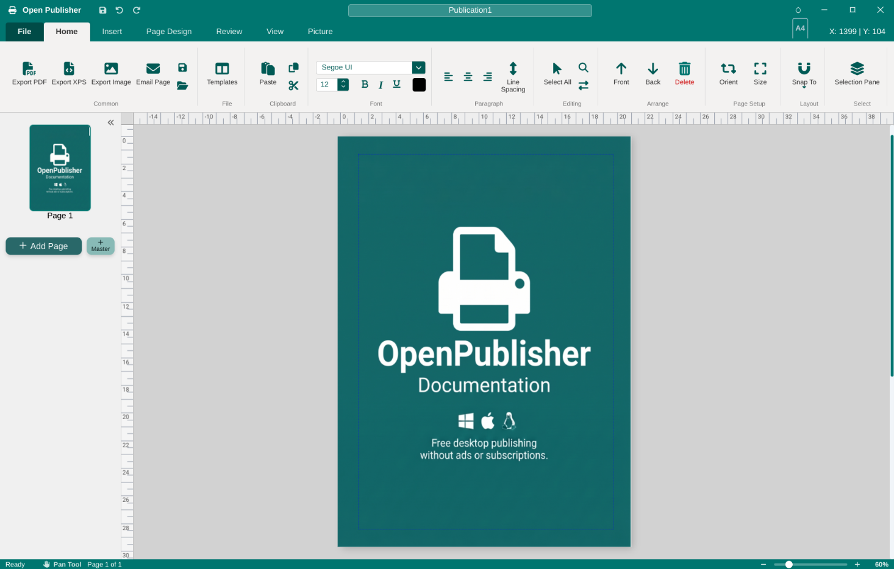
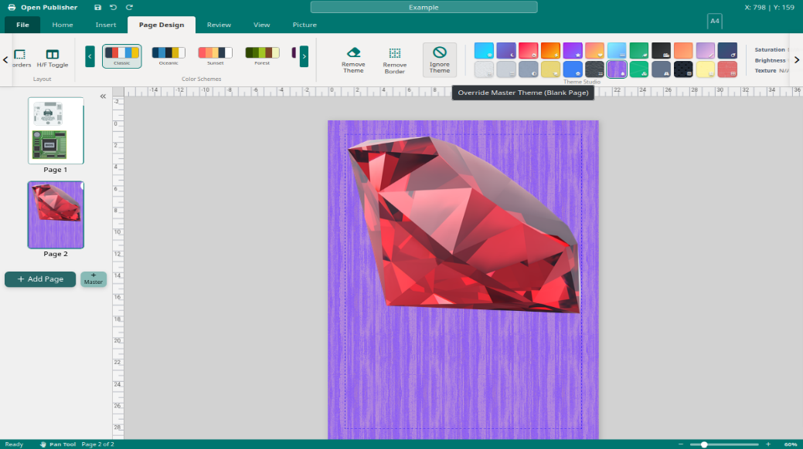
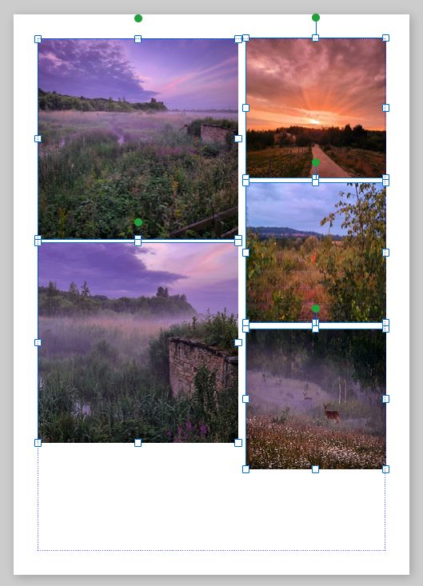

  

<h1 align="center">Open Publisher</h1>

  <strong>Free, professional-grade desktop publishing for Windows, macOS, and Linux.</strong>
   
  No ads. No subscriptions. No compromises.

  
  
  
  
  

---

## Overview

Open Publisher is a WYSIWYG (What You See Is What You Get) desktop publishing application built as a free alternative to tools like Microsoft Publisher. Whether you are creating newsletters, flyers, business cards, posters, booklets, or marketing materials - Open Publisher gives you precision layout tools, rich typography, image manipulation, and comprehensive export capabilities, entirely free.

  

---

> ### 📖 Full Documentation Available
> This README is a quick-reference overview. The complete user guide is packed with **step-by-step instructions, screenshots, and annotated examples** covering every feature in detail.
>
> **[Click here to read the full Open Publisher documentation (PDF)](https://openpublisher.app/documentation.pdf)**

---

## Table of Contents

- [Features at a Glance](#features-at-a-glance)
- [Installation](#installation)
- [The Interface](#the-interface)
- [Page and Document Management](#page-and-document-management)
- [Master Pages and Themes](#master-pages-and-themes)
- [Text Boxes and Typography](#text-boxes-and-typography)
- [Tables](#tables)
- [Images and Graphics](#images-and-graphics)
- [Shapes and Drawing](#shapes-and-drawing)
- [WordArt](#wordart)
- [Clipart, Emojis, and Symbols](#clipart-emojis-and-symbols)
- [Marketing and Promotional Tools](#marketing-and-promotional-tools)
- [Layout and Workspace Tools](#layout-and-workspace-tools)
- [Export and Sharing](#export-and-sharing)
- [Document Security and Privacy](#document-security-and-privacy)
- [The .opub File Format](#the-opub-file-format)

---

## Features at a Glance

| Category | Highlights |
|---|---|
| **Platforms** | Windows (Installer + Portable), macOS (.dmg), Linux (.deb, .rpm, .AppImage), Web Browser |
| **Page Formats** | A3, A4, A5, Letter, Legal, Tabloid, Business Card - with auto locale detection |
| **Export** | PDF, Image, HTML (with SEO injection), XPS, Pack & Go commercial print package, Email (.eml) |
| **Typography** | Full font control, tab stops with leaders, line spacing, drop caps, vertical alignment, linked text boxes |
| **Shapes** | 200+ SVG vector shapes with solid, gradient, texture and pattern fills, 3D rotation engine |
| **Images** | Drag-and-drop, URL import, paste, batch swap, non-destructive crop, 14-shape crop-to-shape |
| **Tables** | 100 styled templates, multi-cell selection, Excel import (xlsx/xls), convert to text |
| **WordArt** | 60+ styles including curved paths, neon, holographic, 3D extrusion, vaporwave |
| **Clipart** | Built-in gallery of 3,403 high-quality transparent images with live search |
| **Security** | AES-GCM password encryption, Document Inspector for metadata/stray objects |
| **Themes** | Document-wide colour schemes (Classic, Pastel, Neon, Corporate) + background textures |
| **Page Borders** | 100 unique scalable SVG border styles with custom colour and thickness |

---

## Installation

### Windows

Open Publisher ships in two forms for Windows:

- **Standard Installer (`.exe`)** - Sets up Start Menu and Desktop shortcuts, and registers the `.opub` file extension in the Windows registry.
- **Portable Version (`.exe`)** - Self-contained, no registry changes, no admin rights required. Drop it anywhere and run it.

  

### macOS

Open Publisher integrates with native macOS conventions:

- Native macOS menu bar with all tools mapped by tab (File, Home, Insert, Page Design, Review, View, Picture)
- Correct app identity ("Open Publisher") in the menu bar, Dock, and system UI
- Native unsaved-changes warning dialog
- Custom splash screen and offline error screen

  

### Linux

Available in three formats for maximum compatibility:

| Package | Distribution |
|---|---|
| `.deb` | Debian / Ubuntu-based |
| `.rpm` | Fedora / RHEL-based |
| `.AppImage` | Any distribution, no installation required |

Installs to `/opt/`, registers `application/x-openpublisher` MIME types, and refreshes icon and MIME caches automatically post-install.

---

## The Interface

  

The workspace is divided into five key areas:

| Area | Description |
|---|---|
| **Ribbon** | Tabbed toolbar at the top: File, Home, Insert, Page Design, Review, View, and contextual tabs |
| **Canvas** | The central white page where you design your document |
| **Navigation Pane** | Left sidebar with live thumbnail previews of all pages |
| **Status Bar** | Bottom bar showing zoom slider, cursor coordinates, and page info |
| **Floating Toolbar** | A compact, context-sensitive bar that appears above selected text boxes |

**Contextual Tabs** - Selecting an element automatically activates the relevant contextual ribbon tab (Text Box Tools, Picture Tools, Drawing Tools, Table Design) with controls specific to that element type.

**Floating Toolbar** - Double-clicking into a text box reveals a "Frost Mint" styled floating toolbar with instant access to font, size, bold, italic, underline, colour, and alignment. Its position is remembered per element.

---

## Page and Document Management

- **Multiple ways to add pages** - Navigation Pane button, right-click context menu, or workspace background right-click
- **Page operations** - Duplicate, Move Up/Down, Delete, all from the thumbnail right-click menu
- **Two-Page Spread Mode** - Display facing pages side-by-side for booklet/magazine design
- **Page Notes** - Attach custom labels to page thumbnails (e.g., "Front Cover", "Chapter 3") displayed in bold teal beneath thumbnails
- **Multi-Page View** - Automatically activates at 45% zoom or below, showing all pages side-by-side
- **Scratch Area** - Off-canvas staging zone for elements not yet placed. Toggle visibility from View > Show
- **Auto Page Numbering** - Dynamic, self-updating page number elements via Insert > Page Number
- **Template Saving** - Save any document as a reusable template

### Page Setup

| Setting | Options |
|---|---|
| **Page Size** | A3, A4, A5, Letter, Legal, Tabloid, Business Card |
| **Orientation** | Portrait / Landscape |
| **Margins** | Normal (0.5"), Narrow (0.25"), Moderate, Wide (1"), Zero (borderless) |

> **Locale-aware defaults:** US, Canada, Mexico, Colombia, Venezuela, Chile, and Philippines default to **Letter**; all other regions default to **A4**.

---

## Master Pages and Themes

**Master Pages** serve as document-wide templates for consistent headers, footers, logos, and backgrounds across all pages. Edit the Master Page once and all standard pages update automatically.

- **Quick Jump** - Double-click the top or bottom 100px of any page canvas to jump directly to the Master Page header or footer area
- **Per-page override** - Right-click any page thumbnail > Master Pages > **None (Hide)** to exempt a page (e.g., a full-bleed cover page)

**Theme Studio** (Page Design ribbon) applies consistent visual styling across the entire document:

  

- **Colour Schemes** - Classic, Pastel, Neon, Corporate. Shapes and elements dynamically update to match
- **Background Themes** - Solid colours, gradients, and textured patterns applied via a dedicated background layer
- **Ignore Theme** - Exempt individual pages from the theme background (e.g., for a back cover)
- **Page Borders** - 100 scalable SVG border styles in categories: Classic, Geometric, Layered/3D, Craft/Deco. Fully customisable colour and thickness

---

## Text Boxes and Typography

Text boxes are the primary container for all written content.

- Insert via **Insert > Text Box**, or press **T** while the canvas is focused
- Contextual **Text Box Tools** ribbon and **Floating Toolbar** provide full typography control

### Text Flow Options

| Feature | Description |
|---|---|
| **Shrink Text on Overflow** | Automatically reduces font size live as you type more than fits |
| **Grow Box to Fit** | Expands the text box downward automatically as you type |
| **Linked Text Boxes** | Chain text boxes across pages for flowing long-form articles |

### Ruler and Spacing Controls

- **Paragraph Indent Markers** - Three interactive markers on the ruler: First Line Indent, Hanging Indent, Left Indent master handle
- **Tab Stops** - Left, Center, Right, Decimal alignment with Dotted, Dashed, Solid, or no tab leaders - perfect for tables of contents and menus
- **Line Spacing** - Set exact point values via the Line Spacing button
- **Vertical Alignment** - Top, Middle, or Bottom alignment within the text box container

### Additional Typography Features

- **Text Fit: Best Fit** - Auto-scales font to fill the text box exactly (right-click > Text Fit > Best Fit)
- **Drop Cap** - Stylises the first letter as a large decorative capital (right-click > Drop Cap)

---

## Tables

Insert tables in multiple ways:

- **Standard Grid** - Insert > Table, drag to select rows/columns
- **Styled Templates** - 100 beautifully pre-formatted table designs
- **Right-Click Context Menu** - Insert > Table directly from the canvas
- **Drag-and-Drop Excel** - Drop a `.xlsx` or `.xls` file directly onto the canvas

### Table Features

| Feature | Description |
|---|---|
| **Multi-cell selection** | Click and drag across cells; apply formatting to groups |
| **Table Layout Sidebar** | Insert/delete rows and columns, 9-way cell alignment grid |
| **Line Spacing in Tables** | Same point-value line height control as text boxes |
| **Convert Table to Text** | Export table data as tab, comma, paragraph, or custom-separated text |
| **Excel Import Wizard** | Styled Data Mode (xlsx, preserves colours/fonts) or Raw Data Mode (xls/xlsx, plain) |

---

## Images and Graphics

Images can be inserted by:
- **Ribbon** - Insert > Picture > browse
- **Drag-and-Drop** - Auto-scales to canvas while maintaining aspect ratio
- **Paste** - `Ctrl+V` / `Cmd+V` from clipboard
- **URL** - Insert > Insert from URL

### Key Image Features

  

- **Picture Placeholders** - Block out image positions with dashed-border frames; double-click to swap with real photos
- **Batch Picture Swap** - Drag multiple images onto the canvas to fill all placeholders automatically, in top-to-bottom/left-to-right order
- **Non-Destructive Crop** - Drag crop handles inward; pan the image within the frame; settings persist across save/load
- **Crop to Shape** - Clip any image to one of 14 shapes: circle, star, triangle, heart, diamond, pentagon, hexagon, octagon, cross, arrows, trapezoid, parallelogram, shield, speech bubble

The **Picture Tools** contextual tab provides access to Crop, Crop to Shape, Recolor filters, shadow effects, and the Format Picture sidebar with hue, brightness, contrast, and opacity controls.

---

## Shapes and Drawing

Open Publisher includes a library of **200+ vector shapes** built from mathematical SVG paths - infinitely scalable at any zoom level or document size.

Shape categories: Basic Geometry, Arrows & Lines, Callouts & Speech, Stars & Bursts, Hearts & Shields, Banners & Ribbons, Flow & Process, Frames & Borders.

### Shape Fill Options

| Fill Type | Details |
|---|---|
| **Solid Colour** | Full colour picker with hex, RGB, and swatches |
| **No Fill (Transparent)** | Hollow shape with border only |
| **Gradient** | Gold, Chrome, Bronze, Silver, Sunset, Ocean presets + custom two-colour tool; Linear, Diagonal, or Radial |
| **Textured Patterns** | 8 styles: Tiny Dots, Polka Dots, Diagonal Lines, Vertical Lines, Horizontal Lines, Crosshatch, Checkerboard, Square Grid |

### Advanced Shape Features

- **3D Rotation Engine** - Rotate shapes along X, Y, Z axes with perspective depth. Automatically flattened to a high-quality PNG for print fidelity. Non-destructive: double-click the PNG to restore live 3D editing
- **Custom Shape Points Editor** - Right-click > Edit Points to drag individual vertices and morph shapes into custom polygons
- **Opacity Slider** - 0-100% transparency for semi-opaque overlay effects
- **Rotation & Flip** - Rotate Right/Left 90 degrees, Flip Horizontal/Vertical, or type any exact degree value

---

## WordArt

The **Beta WordArt** generator produces styled text in 60+ creative styles:

| Category | Examples |
|---|---|
| Classic | 90s Rainbow Gradients, 3D Blue Extrusions, Silver Chrome |
| Modern & Minimal | Clean shadows, thin metallic outlines, flat fills |
| Neon & Glow | Neon wireframes, electric glow halos, cyberpunk outlines |
| Holographic | Glass-like prismatic gradients, holographic foil effects |
| Vaporwave & Retro | Sunset gradients, synthwave purples, pastel 80s palettes |
| 3D & Depth | Extruded letter stacks, bevelled edges, cast shadows |
| Curved & Arched | Arch Up, Arch Down, Wave, Sine Wave, Zig-Zag, Triangle peak |

**Key WordArt behaviours:**
- **Double-click to re-edit** - Reopens the generator pre-filled with your original text and style
- **Dedicated Floating Toolbar** - Edit Text / Change Style buttons in a pill-shaped teal toolbar
- **Hue Shifting** - Shift the entire colour spectrum of any WordArt in real time without regenerating
- **Save as Picture** - Export a pixel-perfect transparent PNG from the right-click menu

---

## Clipart, Emojis, and Symbols

- **Clipart Gallery** - 3,403 high-quality transparent images with live search, lazy loading, and auto-retry on network failures. Gallery shuffles with a Fisher-Yates algorithm every session for fresh results
- **Emojis** - Full Twemoji library (Twitter's open-source SVG emoji set) with free stretching to any size, no letterboxing
- **Insert Symbol** - Rich modal for special characters without memorising Unicode codes
- **QR Code Generator** - Insert > QR Code to generate a scannable code from any URL or text string

---

## Marketing and Promotional Tools

- **Ad Templates and Stickers** - Pre-built marketing layouts
- **Coupons** - Promotional coupon designs
- **QR Codes** - Insert from ribbon or canvas right-click menu
- **Templates Gallery** - File > New > Templates; browse Resumes, Flyers, Menus, Certificates and more

> **Note:** Loading a template replaces only the currently selected page, not the entire document.

---

## Layout and Workspace Tools

### Rulers and Snapping

- **Pixel Rulers** - Run along the top and left canvas edges; toggle via View > Show > Rulers
- **Custom Ruler Origin** - Drag the intersection box to set a new 0,0 point; double-click to reset
- **Three Independent Snapping Modes** - Snap to Grid, Snap to Guides, Snap to Objects (toggle each individually)
- **Hold `Ctrl` while dragging** to temporarily bypass grid snapping without changing the setting
- **Smart Guides** - Teal alignment lines appear when dragging near edges/centres of other elements; smooth fade-in/out

### Zoom Controls

| Shortcut | Action |
|---|---|
| `Ctrl + Mouse Wheel` | Zoom in/out in fine increments |
| `F9` | Toggle between current zoom and 100% |
| `Ctrl + Shift + L` | Whole Page View - fit full page in window |
| `Ctrl + 0` | Reset zoom to 100% |
| Right-click zoom slider | Preset menu: 60%, 70%, 80%, 90%, 100%, 110%, 120%, 130%, 150%, 175%, 200% |

### Selection Pane

**Home > Select > Selection Pane** - A scrollable list of every element on the canvas in Z-order:
- Click to select any element (including buried or obscured objects)
- Toggle visibility with the eye icon; hidden elements are excluded from PDF exports
- Rename elements inline (e.g., "Background Logo", "Footer Bar")
- Updates in real time via MutationObserver

### Custom Colour Picker

The colour picker features a tabbed interface:
- **Swatches** - Quick colour presets
- **Custom** - Professional gradient wheel (2D Saturation/Brightness canvas + 1D Hue slider), RGB spinners, and Hex input, all synchronised in real time

---

## Export and Sharing

| Export Format | Description |
|---|---|
| **PDF** | High-fidelity multi-page PDF with correct orientation, crop settings, and master pages |
| **Export as Image** | Current page as a clean image snapshot (2000px max dimension) |
| **Share via Email (.eml)** | Page embedded as Base64 in a MIME email file; opens directly in Outlook, Apple Mail, Thunderbird |
| **Export as HTML** | Standalone `.html` with newsletter layout, email-client optimization, SEO meta tags, Google Fonts, and mobile scaling |
| **Export as XPS** | Windows XML Paper Specification via the browser's native print engine |
| **Pack & Go** | Commercial print package: extracts all images, lists all fonts used, zips everything for print shop handoff |
| **Booklet Print** | Imposition engine for double-page spread printing with accurate gradient reproduction |

### HTML Export Options (Advanced)

- Seamless Newsletter Layout
- Optimize for Email Clients (html2canvas + legacy `<table>` structure for Gmail, Outlook, Mailchimp)
- Embed External Images as Base64 for single-file offline HTML
- Auto-Scale to Fit Screen (CSS transform for mobile responsiveness)
- Enable / Disable Text Selection and Copying
- Inject SEO & Social Meta Tags (auto-extracts top 5 keywords, 150-character description, injects `og:title`, `og:description`, standard meta tags)
- Minify HTML
- Include Google Fonts

> **Privacy - Pack & Go:** The entire packaging process happens natively in your browser using the open-source JSZip library. Your documents and images are never uploaded to any external server.

---

## Document Security and Privacy

### Password Protection

Open Publisher encrypts documents using the **Web Crypto API (AES-GCM)**, an industry-standard algorithm implemented natively in the browser.

- Encrypted files save as binary blobs, completely unreadable without the correct password
- A "Protected" badge appears in the top-right canvas area when a document is secured
- To open a protected document: open the file, enter the password in the decryption prompt

> **Warning:** There is no password recovery mechanism. If you lose the password, the document cannot be recovered. Always keep a backup of the unprotected source file.

### Document Inspector

**File > Info > Inspect Document** scans across all pages and checks:

| Category | What It Finds |
|---|---|
| Document Properties | Embedded author, company, subject, and keyword metadata |
| Off-Canvas Elements | Objects dragged partially or fully outside the page boundary |
| Empty Text Boxes | Text boxes containing only invisible characters (e.g., non-breaking spaces) |

Each category shows a colour-coded Found/Clean status with a one-click **Remove All** action to purge detected data.

---

## The .opub File Format

Open Publisher's native format is `.opub`:

- **Double-click to open** on all supported platforms after installation
- **Backwards compatible** with older versions of the application
- Stores custom ruler origins, page notes, margin settings, master page overrides, and theme preferences
- Supports **AES-GCM encryption** for protected documents

### Supported Import Formats

| Format | Import Behaviour |
|---|---|
| `.opub` / `.json` | Native format - full fidelity, restores entire working session |
| `.png`, `.jpg`, `.gif`, `.webp` | Placed directly onto the canvas |
| `.pub`, `.pubx` | Experimental legacy Microsoft Publisher import (layout fidelity varies) |
| `.xlsx`, `.xls` | Fully interactive table object via Import Wizard |
| `.doc`, `.docx` | Editable Text Mode or Flattened Image Mode (Safe Mode) |

**Word Document Import Modes:**
1. **Editable Text Mode** - Extracts all text, fonts, and colours into editable Open Publisher text boxes. Best for documents you want to continue editing.
2. **Flattened Image Mode (Safe Mode)** - Renders the document as a high-resolution background image, guaranteeing 100% layout accuracy. Recommended for complex forms, medical tables, or any document where pixel-perfect fidelity matters more than editability.

---

## Keyboard Shortcuts Reference

| Shortcut | Action |
|---|---|
| `T` (on canvas) | Insert new text box |
| `Ctrl + Z` | Undo |
| `F9` | Toggle zoom to/from 100% |
| `Ctrl + Shift + L` | Whole Page View |
| `Ctrl + Shift + O` | Toggle element boundaries |
| `Ctrl + 0` | Reset zoom to 100% |
| `Ctrl + Mouse Wheel` | Zoom in/out |
| `Shift + drag corner` | Proportional resize |
| `Ctrl/Cmd + drag handle` | Scale from centre point |
| `Ctrl/Cmd + Shift + drag` | Proportional scale from centre |
| `Escape` | Exit text editing mode |

---

## Developers

<table align="center">
  <tr>
    <td align="center">
      <a href="https://github.com/rmellis">
         
        <b>rmellis</b>
      </a>
    </td>
    <td align="center">
      <a href="https://github.com/Tallulah95">
         
        <b>Tallulah95</b>
      </a>
    </td>
  </tr>
</table>

---

  <a href="https://openpublisher.app/documentation.pdf">
    <strong>📖 Read the full documentation for step-by-step guides, screenshots, and in-depth feature walkthroughs</strong>
  </a>

---

  <em>Open Publisher - Professional desktop publishing, free for everyone.</em>

