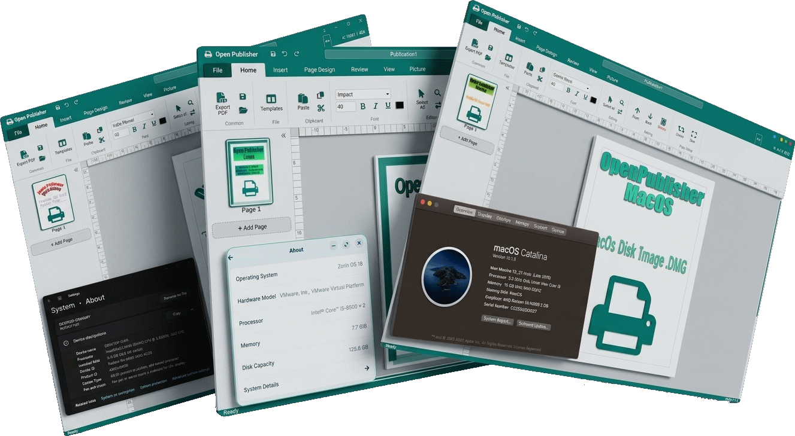
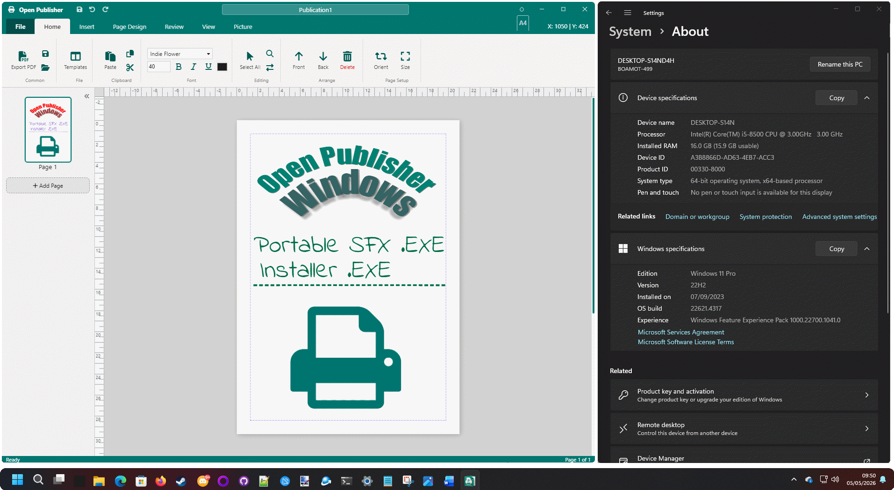
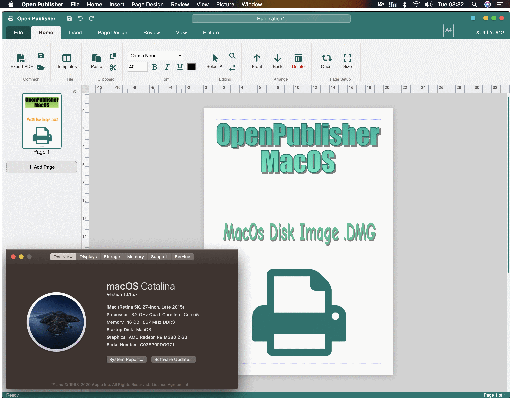
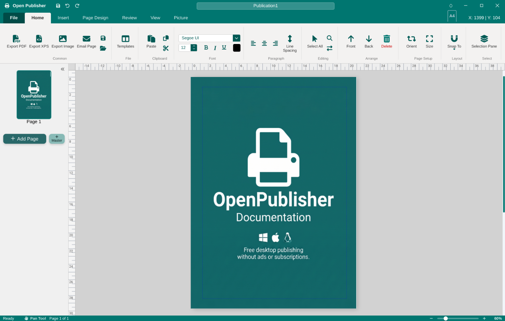
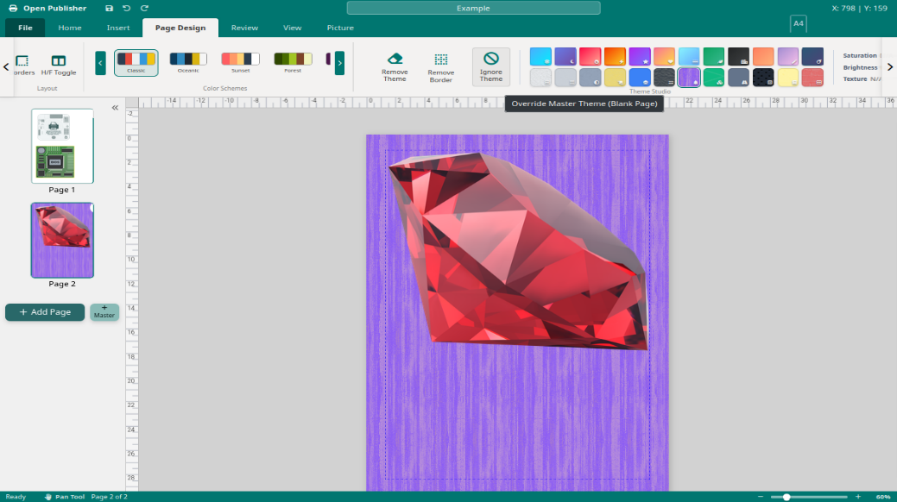
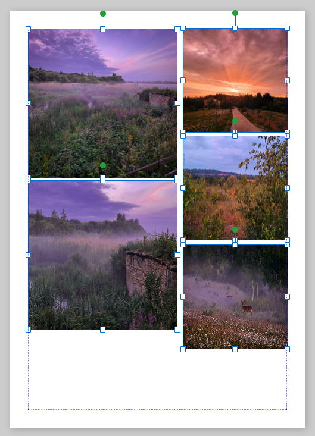

<p align="center">
  
</p>

<h1 align="center">Open Publisher</h1>

<p align="center">
  <strong>Free, professional-grade desktop publishing for Windows, macOS, Linux, and FreeBSD.</strong>
  <br/>
  No ads. No subscriptions. No compromises.
</p>

<p align="center">
  
  
  
  
  
  <a href="https://openpublisher.app/documentation.pdf">
    
  </a>
</p>

---

> [!NOTE]
> **OpenPublisher V5 is now officially released!**
> This milestone release transforms OpenPublisher into a high-performance native desktop publishing suite. Version 5.x unites uncapped 8GB engine memory limits, an atomic 4-step save pipeline, 15-minute background shadow snapshots, a unified cross-platform clipboard engine, native FreeBSD (`.pkg`) and universal Linux (`.flatpak`, `.AppImage`, `.run`, `.deb`, `.rpm`) distributions, offline Hunspell spellchecking, and over 70 architectural enhancements across Windows, macOS, Linux, and FreeBSD.

---

## Overview

Open Publisher is a WYSIWYG (What You See Is What You Get) desktop publishing application built as a free alternative to tools like Microsoft Publisher. Whether you are creating newsletters, flyers, business cards, posters, booklets, or marketing materials - Open Publisher gives you precision layout tools, rich typography, image manipulation, and comprehensive export capabilities, entirely free.

<p align="center">
  
</p>

---

> ### 📖 Full Documentation Available
> This README is a quick-reference overview. The complete user guide is packed with **step-by-step instructions, screenshots, and annotated examples** covering every feature in detail.
>
> **[Click here to read the full Open Publisher documentation (PDF)](https://openpublisher.app/documentation.pdf)**

---

## Table of Contents

- [What's New in Version 5.1.0](#whats-new-in-version-510)
- [Features at a Glance](#features-at-a-glance)
- [Installation and Platform Support](#installation-and-platform-support)
- [The Interface and Workspace](#the-interface-and-workspace)
- [Data Integrity, Saving and Recovery Systems](#data-integrity-saving-and-recovery-systems)
- [Page and Document Management](#page-and-document-management)
- [Master Pages and Themes](#master-pages-and-themes)
- [Text Boxes, Typography and Spellcheck](#text-boxes-typography-and-spellcheck)
- [Tables](#tables)
- [Images, Graphics and Clipboard Scrapbook](#images-graphics-and-clipboard-scrapbook)
- [Shapes and Drawing](#shapes-and-drawing)
- [WordArt](#wordart)
- [Clipart, Emojis, and Symbols](#clipart-emojis-and-symbols)
- [Marketing and Promotional Tools](#marketing-and-promotional-tools)
- [Layout and Workspace Tools](#layout-and-workspace-tools)
- [Export, Presentation and Multi-Page Output](#export-presentation-and-multi-page-output)
- [Developer Tools and Diagnostics](#developer-tools-and-diagnostics)
- [Document Security and Privacy](#document-security-and-privacy)
- [The .opub File Format](#the-opub-file-format)
- [Keyboard Shortcuts Reference](#keyboard-shortcuts-reference)
- [Developers](#developers)

---

<a id="whats-new-in-version-510"></a>
## What's New in Version 5.1.0

Version 5.1.0 represents the largest performance, reliability, and platform engineering milestone in Open Publisher history:

- **Uncapped Engine Memory Limits**: V8 JavaScript heap ceiling uncapped to 8GB RAM, and dedicated video memory extended to 4GB GPU VRAM. Complex publications with hundreds of vector shapes and high-resolution assets render smoothly without out-of-memory crashes.
- **Fail-Safe Data Integrity**:
  - **4-Step Atomic Save Pipeline**: Guarantees zero document corruption via temporary writes, byte-length verification, backup rotation, and atomic OS rename (`fs.renameSync`).
  - **15-Minute Background Shadow Snapshots**: Independent background snapshot engine automatically captures rolling revisions every 15 minutes with a 50-version retention history.
  - **External File Modification Watcher**: Real-time disk monitoring detects when open files are updated externally by cloud services or other apps, offering seamless reload prompts.
- **Unified Client-Side Clipboard Hijack**: Completely overhauled clipboard pipeline across Windows, macOS, Linux, and FreeBSD. Eliminates double-pasting glitches, enables intelligent web image extraction, and provides 100% behavioral parity between physical Ribbon toolbar buttons and operating system shortcuts (`Ctrl+C`, `Ctrl+X`, `Ctrl+V`).
- **Expanded Platform Distribution**:
  - **Universal Linux Flatpak (`.flatpak`)**: Standalone, sandboxed package bundle supporting immutable and atomic distributions (SteamOS on Steam Deck, Fedora Silverblue, openSUSE MicroOS, ChromeOS) with full XDG Desktop Portal integration.
  - **Universal Linux Shell Installer (`.run`)**: Single self-extracting binary installer script (`openpublisher.run`) that runs and installs on any Linux distribution, establishing desktop launcher entries and MIME bindings without package manager restrictions.
  - **Native FreeBSD Port (`.pkg`)**: Standalone Electron runtime bridge with dedicated in-window perimeter resize hitboxes for smooth 60 FPS resizing under X11.
- **Automated Clipboard Scrapbook**: 25-item background OS image cache accessible via a 310px slide-out acrylic glass drawer in the Ribbon, supporting one-click canvas placement.
- **Interactive First-Run Wizard & Flow UI**: Glassmorphic 8-step onboarding tour, unified single-stage splash screen with live boot console, and cross-session theme synchronization.
- **Offline Hunspell Spellchecking**: Bundled offline US and GB dictionaries with real-time red squiggly underlines and right-click suggestion menus.
- **Standalone Auxiliary Windows**: Dedicated tearaway multi-window monitors for the Export Queue, Presentation Preview (`doc_preview.html`), Backup Manager, and Developer HUD.

---

<a id="features-at-a-glance"></a>
## Features at a Glance

| Category | Highlights |
|---|---|
| **Platforms** | Windows (Installer + Portable), macOS (.dmg), Linux (.flatpak, .AppImage, .run, .deb, .rpm), FreeBSD (.pkg), Web Browser |
| **Engine & Limits** | Uncapped 8GB RAM / 4GB GPU VRAM allocation ceiling, asynchronous IPC streams, 60 FPS hardware acceleration |
| **Data Protection** | 4-step atomic save pipeline, 15-minute background snapshots, external file watcher, dedicated AppData backups |
| **Page Formats** | A3, A4, A5, Letter, Legal, Tabloid, Business Card - with auto locale detection |
| **Typography & Fonts** | Full font control, native offline Hunspell spellcheck, Windows registry font discovery, Safari-grade subpixel smoothing |
| **Clipboard & Assets** | Unified client-side clipboard hijack, 25-item Clipboard Scrapbook drawer, drag-and-drop tactile shockwave feedback |
| **Shapes & Vectors** | 200+ SVG vector shapes, solid/gradient/pattern fills, 3D rotation engine, custom point editing |
| **Images & Graphics** | Picture placeholders, batch picture swap, non-destructive crop, 14-shape crop-to-shape, intelligent paste separation |
| **Tables** | 100 styled templates, multi-cell selection, Excel import (xlsx/xls), convert to text, line height control |
| **WordArt** | 60+ styles (Curved, Neon, 3D Extrusion, Holographic, Vaporwave), live hue shifting, double-click re-editing |
| **Clipart & Emojis** | 3,403 high-quality transparent images, full Twemoji vector library, Unicode symbol inserter, QR code generator |
| **Security & Recovery** | AES-GCM password encryption, Document Inspector, automated desktop crash dumps, safe mode launch flags |
| **Workspace & Shell** | Full canvas pasteboard with `Shift + Scroll`, system tray jump list, dynamic dirty asterisk (*), developer HUD |
| **Export & Print** | High-fidelity PDF, standalone export queue, live presentation preview, Pack & Go, HTML with SEO meta tags |

---

<a id="installation-and-platform-support"></a>
## Installation and Platform Support

### Windows

Open Publisher ships in two primary distribution formats for Windows:

- **Standard Installer (`.exe`)** - Full installer with Start Menu and Desktop shortcuts, multi-resolution 10-frame high-DPI icon embedding (up to 256x256), and `.opub` registry file association.
- **Portable Version (`.exe`)** - Self-contained zero-install executable. Ideal for USB drives, restricted workstations, or running without administrator rights.
- **Safe Mode Startup** - Launch with `--safe-mode` or `--reset` from the command line to purge cached data, reset layout bounds, and troubleshoot faulty extensions.

<p align="center">
  
</p>

### macOS

Open Publisher provides first-class native integration on macOS (Apple Silicon and Intel):

- Native macOS menu bar with commands categorized across tabs (File, Home, Insert, Page Design, Review, View, Picture).
- Dynamic accelerator keys that automatically adapt to `Cmd` instead of `Ctrl`.
- Authentic process identity ("Open Publisher") across the menu bar, Dock, and system task monitors.
- Native unsaved-changes confirmation dialogs, high-DPI Retina canvas scaling, and zero-flicker boot sequencing.

<p align="center">
  
</p>

### Linux

Open Publisher is packaged in five formats for universal Linux distribution across all systems:

| Package | Recommended Use Case |
|---|---|
| **`.flatpak`** | **Universal Sandbox:** Best for modern distributions, especially immutable / atomic OSes (SteamOS / Steam Deck, Fedora Silverblue, openSUSE MicroOS, ChromeOS). Isolates dependencies and uses XDG Desktop Portals. |
| **`.AppImage`** | **Standalone Portable:** Single executable file running out of the box on any Linux desktop without installation or root privileges. |
| **`.run`** | **Universal Self-Extracting Installer:** Single-file shell installer script. Installs cleanly to `/opt/openpublisher` (or user directory), sets up desktop icons, and configures `.opub` MIME types on any distribution. |
| **`.deb`** | **Debian & Ubuntu:** Native package for Ubuntu, Debian, Linux Mint, and Pop!_OS. |
| **`.rpm`** | **Fedora & RHEL:** Native package for Fedora, Red Hat Enterprise Linux, Rocky Linux, and openSUSE. |

**Installing via `.run` script:**
```bash
chmod +x openpublisher-5.1.0-linux.run
./openpublisher-5.1.0-linux.run
```

All package formats install cleanly, register `application/x-openpublisher` MIME types, and automatically refresh icon and desktop application caches.

### FreeBSD

Open Publisher V5.1.0 introduces an official native FreeBSD distribution:

- **Standalone Package (`.pkg`)** - Self-contained FreeBSD package built on an Electron runtime bridge (`electron-preload.js`) that polyfills the entire NW.js API surface.
- **Smooth 60 FPS Resizing** - Uses hardware-synchronized `requestAnimationFrame` hitboxes across 8 in-window perimeter points, eliminating legacy window manager stutter under X11.

---

<a id="the-interface-and-workspace"></a>
## The Interface and Workspace

<p align="center">
  
</p>

The workspace is designed for uncluttered creative productivity:

| Area | Description |
|---|---|
| **Ribbon Toolbar** | Tabbed command interface: File, Home, Insert, Page Design, Review, View, and contextual tabs |
| **Infinite Pasteboard & Canvas** | The central high-precision design canvas surrounded by a full horizontal/vertical pasteboard |
| **Navigation Pane** | Left-hand sidebar providing live page thumbnails, page notes, and drag-and-drop page reordering |
| **Status Bar** | Bottom bar with zoom sliders, cursor coordinates, dirty-state indicators, and notification toasts |
| **Floating Contextual Toolbar** | Appears instantly above selected text or WordArt for rapid font, style, and alignment adjustments |
| **Auxiliary Drawer Panels** | Non-modal sliding sidebars for the Clipboard Scrapbook, Format Picture, WordArt, and Table Layout |

- **Contextual Tabs** - Selecting any element automatically activates its specialized ribbon tab (Text Box Tools, Picture Tools, Drawing Tools, Table Design) with relevant editing controls.
- **Dynamic Dirty State Asterisk (*)** - The window titlebar automatically reflects document status in real time, appending an asterisk (`*`) when changes are pending and clearing it upon saving.
- **Recent Documents Dropdown** - Click the down arrow beside the document title in the topbar to view and load your last 10 documents with a visual loading bar.
- **System Tray Integration** - Minimize Open Publisher to the system tray with background jump list shortcuts and optional "Close to System Tray" preference.

---

<a id="data-integrity-saving-and-recovery-systems"></a>
## Data Integrity, Saving and Recovery Systems

Open Publisher V5.1.0 incorporates enterprise-grade protections to ensure your creative work is never lost:

- **4-Step Atomic Save Pipeline**:
  1. Writes serialized document data to an isolated temporary file (`[filename].opub.tmp`).
  2. Verifies the written file on disk to guarantee complete, non-zero byte length.
  3. Safely rotates the existing saved document into the backup directory (`[filename].opub.bak`).
  4. Atomically renames the temporary file into place via OS-level `fs.renameSync`.
- **15-Minute Background Snapshots (Previous Versions)**:
  - Operates automatically in the background, capturing rolling snapshots every 15 minutes when unsaved modifications exist.
  - Maintains a 50-snapshot FIFO history per document.
  - Open snapshots directly via the Previous Versions button in the titlebar to inspect, restore, or open as a fresh copy.
- **External File Modification Watcher**:
  - Uses filesystem observation to monitor open files. If a document is updated externally (e.g., via Dropbox, OneDrive, Git, or another editor), a debounced prompt alerts you to reload the latest version.
- **Chromium Idle Background Auto-Save**:
  - Automatically saves named documents after 10 minutes of system inactivity. For brand new unnamed files, displays a non-stacking in-app prompt when you return.
- **Renderer Crash Recovery**:
  - Webview crashes are intercepted immediately; a replacement process launches automatically with the `--recovered` flag, presenting an interactive session restore modal and generating a diagnostic crash dump on the Desktop.

---

<a id="page-and-document-management"></a>
## Page and Document Management

- **Multiple ways to add pages** - Navigation Pane button, right-click context menu, or workspace background right-click
- **Page operations** - Duplicate, Move Up/Down, Delete, all from the thumbnail right-click menu
- **Two-Page Spread Mode** - Display facing pages side-by-side for booklet/magazine design
- **Page Notes** - Attach custom labels to page thumbnails (e.g., "Front Cover", "Chapter 3") displayed in bold teal beneath thumbnails
- **Multi-Page View** - Automatically activates at 45% zoom or below, showing all pages side-by-side
- **Scratch Area** - Off-canvas staging zone for elements not yet placed. Toggle visibility from View > Show
- **Auto Page Numbering** - Dynamic, self-updating page number elements via Insert > Page Number
- **Template Saving** - Save any document as a reusable template

### Page Setup

| Setting | Options |
|---|---|
| **Page Size** | A3, A4, A5, Letter, Legal, Tabloid, Business Card |
| **Orientation** | Portrait / Landscape |
| **Margins** | Normal (0.5"), Narrow (0.25"), Moderate, Wide (1"), Zero (borderless) |

> **Locale-aware defaults:** US, Canada, Mexico, Colombia, Venezuela, Chile, and Philippines default to **Letter**; all other regions default to **A4**.

---

<a id="master-pages-and-themes"></a>
## Master Pages and Themes

**Master Pages** serve as document-wide templates for consistent headers, footers, logos, and backgrounds across all pages. Edit the Master Page once and all standard pages update automatically.

- **Quick Jump** - Double-click the top or bottom 100px of any page canvas to jump directly to the Master Page header or footer area
- **Per-page override** - Right-click any page thumbnail > Master Pages > **None (Hide)** to exempt a page (e.g., a full-bleed cover page)

**Theme Studio** (Page Design ribbon) applies consistent visual styling across the entire document:

<p align="center">
  
</p>

- **Colour Schemes** - Classic, Pastel, Neon, Corporate. Shapes and elements dynamically update to match
- **Background Themes** - Solid colours, gradients, and textured patterns applied via a dedicated background layer
- **Ignore Theme** - Exempt individual pages from the theme background (e.g., for a back cover)
- **Page Borders** - 100 scalable SVG border styles in categories: Classic, Geometric, Layered/3D, Craft/Deco. Fully customisable colour and thickness

---

<a id="text-boxes-typography-and-spellcheck"></a>
## Text Boxes, Typography and Spellcheck

Text boxes are the primary container for all written content in Open Publisher.

- Insert via **Insert > Text Box**, or press **T** while the canvas is focused.
- Contextual **Text Box Tools** ribbon and **Floating Toolbar** provide complete typography control.

### Advanced Typography & Proofing

- **Native Spellcheck Engine**: Integrated offline Hunspell dictionaries (English US and GB) with red squiggly underlines and right-click suggestion menus.
- **Windows System Fonts Discovery**: Merges installed local TrueType and OpenType fonts from the Windows registry with Google Fonts.
- **Subpixel Font Smoothing**: Safari-style text anti-aliasing and geometric vector precision across all zoom levels.

### Text Flow Options

| Feature | Description |
|---|---|
| **Shrink Text on Overflow** | Automatically reduces font size live as you type more than fits |
| **Grow Box to Fit** | Expands the text box downward automatically as you type |
| **Linked Text Boxes** | Chain text boxes across pages for flowing long-form articles |

### Ruler and Spacing Controls

- **Paragraph Indent Markers** - Three interactive markers on the ruler: First Line Indent, Hanging Indent, Left Indent master handle
- **Tab Stops** - Left, Center, Right, Decimal alignment with Dotted, Dashed, Solid, or no tab leaders - perfect for tables of contents and menus
- **Line Spacing** - Set exact point values via the Line Spacing button
- **Vertical Alignment** - Top, Middle, or Bottom alignment within the text box container
- **Drop Cap & Best Fit** - Stylize opening letters or auto-scale typography to fill text boxes precisely

---

<a id="tables"></a>
## Tables

Insert tables in multiple ways:

- **Standard Grid** - Insert > Table, drag to select rows/columns
- **Styled Templates** - 100 beautifully pre-formatted table designs
- **Right-Click Context Menu** - Insert > Table directly from the canvas
- **Drag-and-Drop Excel** - Drop a `.xlsx` or `.xls` file directly onto the canvas

### Table Features

| Feature | Description |
|---|---|
| **Multi-cell selection** | Click and drag across cells; apply formatting to groups |
| **Table Layout Sidebar** | Insert/delete rows and columns, 9-way cell alignment grid |
| **Line Spacing in Tables** | Same point-value line height control as text boxes |
| **Convert Table to Text** | Export table data as tab, comma, paragraph, or custom-separated text |
| **Excel Import Wizard** | Styled Data Mode (xlsx, preserves colours/fonts) or Raw Data Mode (xls/xlsx, plain) |

---

<a id="images-graphics-and-clipboard-scrapbook"></a>
## Images, Graphics and Clipboard Scrapbook

Images can be imported into your publication through multiple intuitive workflows:

- **Drag-and-Drop** - Drop images directly onto the canvas with visual shockwave ripples, particle bursts, and badge feedback.
- **Universal Clipboard Paste** - `Ctrl+V` / `Cmd+V` or Ribbon Paste. Intelligent paste separation extracts web images into standalone canvas objects while inserting text into active boxes.
- **Automated Clipboard Scrapbook** - A 25-item background OS image cache in a dark acrylic slide-out drawer (`Home -> Clipboard` or `Insert -> Illustrations`). Click or drag any cached image onto the canvas.
- **URL & File Dialogs** - Insert > Picture or Insert > Insert from URL.

<p align="center">
  
</p>

- **Picture Placeholders** - Block out image positions with dashed-border frames; double-click to swap with real photos
- **Batch Picture Swap** - Drag multiple images onto the canvas to fill all placeholders automatically, in top-to-bottom/left-to-right order
- **Non-Destructive Crop** - Drag crop handles inward; pan the image within the frame; settings persist across save/load
- **Crop to Shape** - Clip any image to one of 14 shapes: circle, star, triangle, heart, diamond, pentagon, hexagon, octagon, cross, arrows, trapezoid, parallelogram, shield, speech bubble
- **Picture Tools** - Recolor filters, shadow effects, hue, brightness, contrast, and opacity controls

---

<a id="shapes-and-drawing"></a>
## Shapes and Drawing

Open Publisher includes a library of **200+ vector shapes** built from mathematical SVG paths - infinitely scalable at any zoom level or document size.

Shape categories: Basic Geometry, Arrows & Lines, Callouts & Speech, Stars & Bursts, Hearts & Shields, Banners & Ribbons, Flow & Process, Frames & Borders.

### Shape Fill Options

| Fill Type | Details |
|---|---|
| **Solid Colour** | Full colour picker with hex, RGB, and swatches |
| **No Fill (Transparent)** | Hollow shape with border only |
| **Gradient** | Gold, Chrome, Bronze, Silver, Sunset, Ocean presets + custom two-colour tool; Linear, Diagonal, or Radial |
| **Textured Patterns** | 8 styles: Tiny Dots, Polka Dots, Diagonal Lines, Vertical Lines, Horizontal Lines, Crosshatch, Checkerboard, Square Grid |

### Advanced Shape Features

- **3D Rotation Engine** - Rotate shapes along X, Y, Z axes with perspective depth. Automatically flattened to a high-quality PNG for print fidelity. Non-destructive: double-click the PNG to restore live 3D editing
- **Custom Shape Points Editor** - Right-click > Edit Points to drag individual vertices and morph shapes into custom polygons
- **Opacity Slider** - 0-100% transparency for semi-opaque overlay effects
- **Rotation & Flip** - Rotate Right/Left 90 degrees, Flip Horizontal/Vertical, or type any exact degree value

---

<a id="wordart"></a>
## WordArt

The **WordArt Studio** generates styled typographic art across 60+ creative styles:

| Category | Examples |
|---|---|
| Classic | 90s Rainbow Gradients, 3D Blue Extrusions, Silver Chrome |
| Modern & Minimal | Clean shadows, thin metallic outlines, flat fills |
| Neon & Glow | Neon wireframes, electric glow halos, cyberpunk outlines |
| Holographic | Glass-like prismatic gradients, holographic foil effects |
| Vaporwave & Retro | Sunset gradients, synthwave purples, pastel 80s palettes |
| 3D & Depth | Extruded letter stacks, bevelled edges, cast shadows |
| Curved & Arched | Arch Up, Arch Down, Wave, Sine Wave, Zig-Zag, Triangle peak |

**Key WordArt behaviours:**
- **Double-click to re-edit** - Reopens the generator pre-filled with your original text and style
- **Dedicated Floating Toolbar** - Edit Text / Change Style buttons in a pill-shaped teal toolbar
- **Hue Shifting** - Shift the entire colour spectrum of any WordArt in real time without regenerating
- **Save as Picture** - Export a pixel-perfect transparent PNG from the right-click menu

---

<a id="clipart-emojis-and-symbols"></a>
## Clipart, Emojis, and Symbols

- **Clipart Gallery** - 3,403 high-quality transparent images with live search, lazy loading, and auto-retry on network failures. Gallery shuffles with a Fisher-Yates algorithm every session for fresh results
- **Emojis** - Full Twemoji library (Twitter's open-source SVG emoji set) with free stretching to any size, no letterboxing
- **Insert Symbol** - Rich modal for special characters without memorising Unicode codes
- **QR Code Generator** - Insert > QR Code to generate a scannable code from any URL or text string

---

<a id="marketing-and-promotional-tools"></a>
## Marketing and Promotional Tools

- **Ad Templates and Stickers** - Pre-built marketing layouts
- **Coupons** - Promotional coupon designs
- **QR Codes** - Insert from ribbon or canvas right-click menu
- **Templates Gallery** - File > New > Templates; browse Resumes, Flyers, Menus, Certificates and more

> **Note:** Loading a template replaces only the currently selected page, not the entire document.

---

<a id="layout-and-workspace-tools"></a>
## Layout and Workspace Tools

### Rulers, Guides and Snapping

- **Pixel Rulers** - Run along the top and left canvas edges; toggle via View > Show > Rulers
- **Custom Ruler Origin** - Drag the intersection box to set a new 0,0 point; double-click to reset
- **Three Independent Snapping Modes** - Snap to Grid, Snap to Guides, Snap to Objects (toggle each individually)
- **Hold `Ctrl` while dragging** to temporarily bypass grid snapping without changing the setting
- **Smart Guides** - Teal alignment lines appear when dragging near edges/centres of other elements; smooth fade-in/out

### Canvas Navigation & Zoom

- **Shift + Mouse Wheel Horizontal Navigation** - Smooth horizontal panning across the wide canvas pasteboard at all zoom levels.
- **Liquid Content Pour Animation** - Cascading entrance animation with zero-flicker pre-paint clamping when documents load.

| Shortcut | Action |
|---|---|
| `Ctrl + Mouse Wheel` | Zoom in/out in fine increments |
| `Shift + Mouse Wheel` | Pan canvas horizontally |
| `F9` | Toggle between current zoom and 100% |
| `Ctrl + Shift + L` | Whole Page View - fit full page in window |
| `Ctrl + 0` | Reset zoom to 100% |
| Right-click zoom slider | Preset menu: 60%, 70%, 80%, 90%, 100%, 110%, 120%, 130%, 150%, 175%, 200% |

### Selection Pane

**Home > Select > Selection Pane** - A scrollable list of every element on the canvas in Z-order:
- Click to select any element (including buried or obscured objects)
- Toggle visibility with the eye icon; hidden elements are excluded from PDF exports
- Rename elements inline (e.g., "Background Logo", "Footer Bar")
- Updates in real time via MutationObserver

---

<a id="export-presentation-and-multi-page-output"></a>
## Export, Presentation and Multi-Page Output

| Export Format | Description |
|---|---|
| **PDF** | High-fidelity multi-page PDF with correct orientation, crop settings, and master pages |
| **Standalone Export Queue** | Dedicated tearaway monitor window tracking PDF and print rendering jobs with taskbar progress |
| **Presentation Preview** | Distraction-free live presentation preview window (`doc_preview.html`) for reviewing layouts |
| **Export as Image** | Current page as a clean image snapshot (2000px max dimension) |
| **Share via Email (.eml)** | Page embedded as Base64 in a MIME email file; opens directly in Outlook, Apple Mail, Thunderbird |
| **Export as HTML** | Standalone `.html` with newsletter layout, email-client optimization, SEO meta tags, Google Fonts, and mobile scaling |
| **Export as XPS** | Windows XML Paper Specification via the browser's native print engine |
| **Pack & Go** | Commercial print package: extracts all images, lists all fonts used, zips everything for print shop handoff |
| **Booklet Print** | Imposition engine for double-page spread printing with accurate gradient reproduction |

### HTML Export Options (Advanced)

- Seamless Newsletter Layout
- Optimize for Email Clients (html2canvas + legacy `<table>` structure for Gmail, Outlook, Mailchimp)
- Embed External Images as Base64 for single-file offline HTML
- Auto-Scale to Fit Screen (CSS transform for mobile responsiveness)
- Enable / Disable Text Selection and Copying
- Inject SEO & Social Meta Tags (auto-extracts top 5 keywords, 150-character description, injects `og:title`, `og:description`, standard meta tags)
- Minify HTML
- Include Google Fonts

> **Privacy - Pack & Go:** The entire packaging process happens natively in your browser using the open-source JSZip library. Your documents and images are never uploaded to any external server.

---

<a id="developer-tools-and-diagnostics"></a>
## Developer Tools and Diagnostics

Open Publisher V5.1.0 includes built-in diagnostic and developer tooling:

- **Developer HUD (`Ctrl+Shift+D`)**: Floating heads-up display showing live memory allocation graphs, RSS change rates, active DOM node counts, and frame rates.
- **Standalone Tearaway HUD**: Pop out the Developer HUD into an independent floating window (`hud.html`) across multi-monitor setups.
- **Bidirectional IPC Sniffer**: Real-time traffic monitor capturing and logging all communication passing between the host wrapper and webview.
- **Automated Crash Logging**: Automatically dumps hardware specifications, memory statistics, and process uptime to `OpenPublisher-Crash-Log.txt` on the Desktop if a crash occurs.
- **Safe Mode Actions**: Built-in actions to reboot the application in diagnostic Safe Mode directly from the HUD.
- **Microsoft Agent (Clippy)**: Nostalgic interactive assistant featuring 41 authentic animations and 101 productivity tips.

---

<a id="document-security-and-privacy"></a>
## Document Security and Privacy

### Password Protection

Open Publisher encrypts documents using the **Web Crypto API (AES-GCM)**, an industry-standard algorithm implemented natively in the browser.

- Encrypted files save as binary blobs, completely unreadable without the correct password
- A "Protected" badge appears in the top-right canvas area when a document is secured
- To open a protected document: open the file, enter the password in the decryption prompt

> **Warning:** There is no password recovery mechanism. If you lose the password, the document cannot be recovered. Always keep a backup of the unprotected source file.

### Document Inspector

**File > Info > Inspect Document** scans across all pages and checks:

| Category | What It Finds |
|---|---|
| Document Properties | Embedded author, company, subject, and keyword metadata |
| Off-Canvas Elements | Objects dragged partially or fully outside the page boundary |
| Empty Text Boxes | Text boxes containing only invisible characters (e.g., non-breaking spaces) |

Each category shows a colour-coded Found/Clean status with a one-click **Remove All** action to purge detected data.

---

<a id="the-opub-file-format"></a>
## The .opub File Format

Open Publisher's native format is `.opub`:

- **Double-click to open** on all supported platforms after installation
- **Backwards compatible** with older versions of the application
- Stores custom ruler origins, page notes, margin settings, master page overrides, and theme preferences
- Supports **AES-GCM encryption** for protected documents

### Supported Import Formats

| Format | Import Behaviour |
|---|---|
| `.opub` / `.json` | Native format - full fidelity, restores entire working session |
| `.png`, `.jpg`, `.gif`, `.webp`, `.svg` | Placed directly onto the canvas with visual feedback |
| `.pub`, `.pubx` | Experimental legacy Microsoft Publisher import (layout fidelity varies) |
| `.xlsx`, `.xls` | Fully interactive table object via Import Wizard |
| `.doc`, `.docx` | Editable Text Mode or Flattened Image Mode (Safe Mode) |

**Word Document Import Modes:**
1. **Editable Text Mode** - Extracts all text, fonts, and colours into editable Open Publisher text boxes. Best for documents you want to continue editing.
2. **Flattened Image Mode (Safe Mode)** - Renders the document as a high-resolution background image, guaranteeing 100% layout accuracy. Recommended for complex forms, medical tables, or any document where pixel-perfect fidelity matters more than editability.

---

<a id="keyboard-shortcuts-reference"></a>
## Keyboard Shortcuts Reference

| Shortcut | Action |
|---|---|
| `T` (on canvas) | Insert new text box |
| `Ctrl + Z` | Undo |
| `Ctrl + Y` / `Ctrl + Shift + Z` | Redo |
| `Ctrl + C` | Copy element or selected text |
| `Ctrl + X` | Cut element or selected text |
| `Ctrl + V` | Paste with intelligent context routing |
| `Ctrl + Shift + V` | Paste without styles |
| `Ctrl + A` | Select all |
| `Ctrl + S` | Save document (Atomic Pipeline) |
| `Delete` / `Backspace` | Delete selected element |
| `F9` | Toggle zoom to/from 100% |
| `F11` | Native borderless fullscreen toggle |
| `Shift + Mouse Wheel` | Pan canvas horizontally |
| `Ctrl + Shift + D` | Toggle Developer HUD |
| `Ctrl + Shift + O` / `Ctrl + Shift + P` | Bring application forward globally |
| `Ctrl + Shift + L` | Whole Page View |
| `Ctrl + 0` | Reset zoom to 100% |
| `Ctrl + Mouse Wheel` | Zoom in/out |
| `Shift + drag corner` | Proportional resize |
| `Ctrl/Cmd + drag handle` | Scale from centre point |
| `Ctrl/Cmd + Shift + drag` | Proportional scale from centre |
| `Escape` | Exit text editing mode |

---

<a id="developers"></a>
## Developers

<table align="center">
  <tr>
    <td align="center">
      <a href="https://github.com/rmellis">
        <br/>
        <sub><b>rmellis</b></sub>
      </a>
    </td>
    <td align="center">
      <a href="https://github.com/Tallulah95">
        <br/>
        <sub><b>Tallulah95</b></sub>
      </a>
    </td>
  </tr>
</table>

---

<p align="center">
  <a href="https://openpublisher.app/documentation.pdf">
    <strong>📖 Read the full documentation for step-by-step guides, screenshots, and in-depth feature walkthroughs</strong>
  </a>
</p>

---

<p align="center">
  <em>Open Publisher - Professional desktop publishing, free for everyone.</em>
</p>
