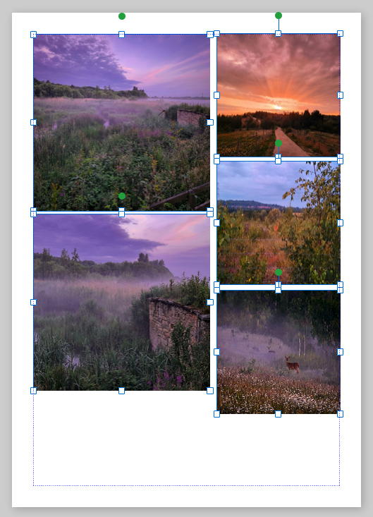

<p align="center">
  
</p>
<p align="center">
<strong>Open Publisher</strong>, Free, professional-grade desktop publishing<br> Available for Windows, macOS, Linux, and FreeBSD.
  <br/>
  No ads. No subscriptions. No compromises.
</p>

<p align="center">
  
  
  
  
  
  <a href="https://kb.openpublisher.app"></a>
  <a href="https://openpublisher.app/documentation.pdf"></a>
</p>

---

## Overview

Open Publisher is a WYSIWYG (What You See Is What You Get) desktop publishing application built as a free alternative to tools like Microsoft Publisher. Whether you are creating newsletters, flyers, business cards, posters, booklets, or marketing materials - Open Publisher gives you precision layout tools, rich typography, image manipulation, and comprehensive export capabilities, entirely free.
<p align="center">
  
</p>

---

<div align="center">

##  Download Open Publisher v5

<table>
<tr>
  <th align="center" width="20%">
     
    Windows
  </th>
  <th align="center" width="20%">
     
    macOS
  </th>
  <th align="center" width="20%">
     
    Linux
  </th>
  <th align="center" width="20%">
     
    FreeBSD
  </th>
  <th align="center" width="20%">
     
    Web
  </th>
</tr>
<tr>
  <td align="center" valign="top">
    <br/>
    <a href="https://github.com/rmellis/open-publisher/releases/download/5.1.4/openpublisher5_amd64-windows.exe"><strong>Installer (.exe)</strong></a><br/>
    <a href="https://github.com/rmellis/open-publisher/releases/download/5.1.4/openpublisher5_amd64-windows-portable.exe">Portable (.zip)</a>
  </td>
  <td align="center" valign="top">
    <br/>
    <a href="https://github.com/rmellis/open-publisher/releases/download/5.1.9/openpublisher5_amd64-macos.dmg"><strong>Intel</strong> (.dmg)</a><br/>
    <a href="https://github.com/rmellis/open-publisher/releases/download/5.1.4/openpublisher5_amd64-macos.dmg"><strong>Intel</strong> Legacy 10.15 (.dmg)</a>
  </td>
  <td align="center" valign="top">
    <br/>
    <a href="https://github.com/rmellis/open-publisher/releases/download/5.1.4/openpublisher5_amd64-linux.flatpak"><strong>Flatpak</strong></a> · <a href="https://github.com/rmellis/open-publisher/releases/download/5.1.4/openpublisher5_amd64-linux.AppImage"><strong>AppImage</strong></a><br/>
    <a href="https://github.com/rmellis/open-publisher/releases/download/5.1.4/openpublisher5_amd64-linux.deb">.deb</a> · <a href="https://github.com/rmellis/open-publisher/releases/download/5.1.4/openpublisher5_amd64-linux.rpm">.rpm</a><br/>
    <a href="https://github.com/rmellis/open-publisher/releases/download/5.1.4/openpublisher5_amd64-linux.run">.run Installer</a>
  </td>
  <td align="center" valign="top">
    <br/>
    <a href="https://github.com/rmellis/open-publisher/releases/download/5.1.4/openpublisher5_amd64-freebsd.pkg"><strong>Installer (.pkg)</strong></a>
  </td>
  <td align="center" valign="top">
    <br/>
    <a href="https://openpublisher.app"><strong>Open in Browser</strong></a><br/>
    <sub>No install required, but slightly less features</sub>
  </td>
</tr>
</table>

</div>


---

> ### 📖 Documentation & Knowledge Base
> This README is a quick-reference overview. For complete, up-to-date guides packed with **step-by-step instructions, screenshots, and tutorials**, visit our interactive knowledge base:
>
> 🚀 **[Visit the Open Publisher Knowledge Base (kb.openpublisher.app)](https://kb.openpublisher.app)**
>
> <details>
>   <summary><small>Looking for the legacy documentation? (PDF)</small></summary>
>   <br/>
>   You can still download the original manual here: 
>   <a href="https://openpublisher.app/documentation.pdf">Open Publisher User Guide (PDF)</a>
> </details>
---

## Table of Contents

- [What's New in Version 5](#whats-new-in-version-5)
- [Features at a Glance](#features-at-a-glance)
- [Installation and Platform Support](#installation-and-platform-support)
- [The Dashboard and Startup Experience](#the-dashboard-and-startup-experience)
- [The Interface and Workspace](#the-interface-and-workspace)
- [Data Integrity, Saving and Recovery Systems](#data-integrity-saving-and-recovery-systems)
- [Page and Document Management](#page-and-document-management)
- [Physical Measurement Units and DPI](#physical-measurement-units-and-dpi)
- [Master Pages and Themes](#master-pages-and-themes)
- [Text Boxes, Typography and Spellcheck](#text-boxes-typography-and-spellcheck)
- [Tables](#tables)
- [Images, Graphics and Clipboard Scrapbook](#images-graphics-and-clipboard-scrapbook)
- [Picture Tools Ribbon](#picture-tools-ribbon)
- [Shapes and Drawing](#shapes-and-drawing)
- [WordArt](#wordart)
- [Clipart, Emojis, and Symbols](#clipart-emojis-and-symbols)
- [Marketing and Promotional Tools](#marketing-and-promotional-tools)
- [Layout and Workspace Tools](#layout-and-workspace-tools)
- [Export, Presentation and Multi-Page Output](#export-presentation-and-multi-page-output)
- [Developer Tools and Diagnostics](#developer-tools-and-diagnostics)
- [Document Security and Privacy](#document-security-and-privacy)
- [The .opub File Format](#the-opub-file-format)
- [Keyboard Shortcuts Reference](#keyboard-shortcuts-reference)
- [Developers](#developers)

---

<a id="whats-new-in-version-5"></a>
## What's New in Version 5

Version 5 is the most significant release in Open Publisher's history - a complete re-engineering of the desktop wrapper, canvas engine, and print pipeline. Every area of the application has been rebuilt or substantially improved.

<details>
<summary>🔍 Expand to see all V5 feature highlights</summary>

### 🛡️ Saving, Backups and File Safety

- **Atomic Save Pipeline** - Every save uses a 4-step crash-safe write: write to `.tmp`, verify byte length, rotate existing file to backup, atomically rename. If anything fails, the original is never touched - corruption is physically impossible.
- **Auto-Save on Idle** - Automatically saves named documents silently after 10 minutes of system inactivity using Chromium's idle detection API. No user action required.
- **Idle Save Modal** - For unsaved new documents, a single draggable in-app dialog appears after 10 minutes of inactivity prompting Save As. Never stacks duplicate dialogs no matter how long you're away.
- **Backup Manager** - A draggable, searchable modal listing all `.bak` backup files with publication name, date/time, file size, and page count. Open any backup as a safe independent copy; saving it triggers Save As rather than overwriting the archive.
- **Backup Directory Relocation** - Backup files are now stored in `AppData\Local\OpenPublisher\Backups` instead of your working project folder. Old `.bak` files in working directories are cleaned up automatically on the next save.
- **Previous Versions** - Automatic timestamped snapshots every 15 minutes for documents with unsaved edits, plus a snapshot before every manual save. Up to 50 snapshots per document. Includes search, filter by current document, manual "Take Snapshot", "Open as Copy", and "Restore" with safety backup.
- **External File Watcher** - Monitors the open `.opub` file for external changes (cloud sync, other editors). Detects modifications and prompts you to reload. Intelligently ignores events from the app's own save process.
- **Non-Blocking Async Save** - Saving large documents never freezes or stutters the UI. The entire save pipeline runs on a background IPC stream.
- **Power Management Keep-Awake** - The OS is prevented from sleeping or activating the screen saver during saves and exports. Normal power behavior resumes immediately afterward.
- **Native Desktop Save Notification** - A native OS notification toast appears after every successful save.

### 📋 Clipboard and Copy/Paste

- **Canvas Element Copy, Cut and Paste** - Fully functional copy, cut, and paste of canvas elements via `Ctrl+C/X/V`, ribbon buttons, right-click menu, and the native menu bar. Correctly distinguishes between copying a canvas element vs. copying text inside an active text box.
- **Clean Native Clipboard Paste** - The Paste button in the ribbon and right-click menu silently invokes the native OS clipboard paste, bypassing web security restrictions. Preserves all rich clipboard data including fonts, RTF, and images.
- **Clipboard Bug Fixes** - Fixed double-pasting, ribbon Paste button ignoring newly copied external content, internal canvas tokens leaking as raw text into text boxes, and copy failing in sandboxed environments.
- **Clipboard Scrapbook** - A persistent floating sidebar drawer that monitors the OS clipboard for images every 2 seconds and caches the last 25. Insert any image onto the canvas with one click or drag-and-drop. Persists across application launches.
- **Paste Image Separation** - When pasting mixed content from a website, images are automatically separated from text. Text pastes into the text box; images are independently placed on the canvas as separate objects.

### 📁 Drag and Drop

- **Drag-and-Drop Publication Opening** - Drag any `.opub` or `.json` file from Windows Explorer onto the app window to open it. A full-screen "Drop to open publication" overlay appears during the drag.
- **Document Pour Animation** - When any document opens, canvas elements animate into place from top to bottom with a smooth organic stagger and a teal-green wave sheen. Eliminates the old flash-of-content glitch.
- **Image Drag-and-Drop Import** - Drag image files (PNG, JPEG, GIF, WebP, SVG, BMP, ICO, AVIF, TIFF) from any folder directly onto the app window to import them onto the canvas. The publication-open overlay is suppressed for image drags.

### 🖥️ Window and Titlebar

- **Rounded Corners and Drop Shadow** - The frameless window has a 12px border radius and ambient drop shadow via Windows DWM alpha compositing.
- **Ghost-Frame Resize Engine** - A transparent preview overlay shows exact new dimensions and a live size badge while dragging any edge or corner. Eliminates all resize flicker and lag.
- **Window State Persistence** - Size, position, and maximized state saved and restored exactly across restarts. If the saved monitor is disconnected, the window reappears safely on the primary display.
- **Always-on-Top Pin Button** - Pushpin icon in the titlebar. Glows green when engaged. Tooltip updates between "Pin window" and "Unpin window". Auto-hides on narrow windows.
- **F11 Fullscreen** - Native borderless fullscreen toggle. Titlebar controls stay accessible as an overlay.
- **Dirty-State Asterisk (*)** - Appears next to the document title in the titlebar whenever unsaved changes exist. Disappears immediately on save.
- **Smart Exit Dialog** - The close button only shows an unsaved-changes warning if edits actually exist. Clean documents close instantly with no prompt.
- **Modernized Exit Dialog** - Left-aligned text, pill-shaped buttons, OS-standard 6px corners. Save as primary; "Don't Save" and "Cancel" as outlined secondary buttons.
- **Show in File Explorer** - Folder icon button in the titlebar highlights the current file in Windows Explorer instantly. Dims when no file has been saved yet.
- **Close to System Tray Toggle** - When enabled, clicking X hides the app to the tray instead of closing. Re-launching restores and focuses the existing instance.
- **Single Instance Enforcement** - Opening a second `.opub` from Windows Explorer loads it in the existing window rather than opening a duplicate.

### 🗂️ System Tray

- **System Tray Integration** - Full right-click jump list: Show/Hide Window, New Publication, Open Publication, Save, Recent Publications submenu (synced live with in-app list, with Clear History), Backup Manager, Previous Versions, Developer HUD toggle, and Exit with unsaved-changes guard.
- **Global OS Keyboard Shortcut** - `Ctrl+Shift+O` / `Ctrl+Shift+P` (or `Cmd+Shift+O/P` on macOS) brings Open Publisher to the foreground from anywhere on the OS, even if minimized or hidden in the tray.

### 📊 Taskbar Integration

- **Taskbar Progress Bar** - The taskbar icon shows a live progress bar during saves (indeterminate) and exports (real percentage fill).
- **Taskbar Attention Flash** - When a save or export completes while the app is minimized or in the background, the taskbar button flashes to notify you. Stops automatically when you switch back.
- **Export Priority Elevation** - During active exports, the OS process priority is elevated to above-normal for maximum CPU allocation, then returned to normal on completion.

### 📤 Export and Print Queue Monitor

- **Export and Print Queue Window** - A standalone floating dark-glass window showing real-time progress for all active PDF, image, and print jobs. Includes job history, percentage progress, status indicators, filter by type (All/Print/PDF/Image), "Open in Folder", and direct file launch.
- **Real-Time Export Progress on Taskbar** - Live export percentage from the webapp is reflected on the OS taskbar progress bar (0-100%).

### 📂 Recent Files

- **Recent Files Dropdown** - Titlebar button lists the last 10 opened documents with filename and full path. Clicking an entry fully restores the document's DPI, format, unit, orientation, margins, and spread mode.
- **Single Instance File Association** - Double-clicking a `.opub` from Windows Explorer while the app is open loads it in the existing instance rather than spawning a new window.

### 🎬 Presentation Preview

- **Presentation Preview Window** - A standalone floating frameless window that mirrors the active canvas in real time using pure DOM/SVG cloning (no html2canvas - crisp vector output). Has its own page thumbnail strip, zoom presets (50% to 200%), mouse-wheel zoom, and a dedicated fullscreen presentation mode. Independently moveable; closes with the main app.

### 🚀 Startup and Splash Screen

- **Unified V5 Splash Screen** - Single-phase splash replacing the old double-splash. Features a faceted geometric backdrop, V5 vector branding, real-time boot console with 178 color-coded milestones, and a smooth subpixel progress bar that never goes backwards.
- **Adaptive Dual-Theme Splash** - Teal/green gradient with white logo in light mode; deep dark slate with cyan accents in dark mode. Dynamic status labels update throughout loading.
- **Dynamic OS Edition Detection** - The splash footer automatically displays the correct platform: Windows Edition, Mac Edition, Linux Edition, or FreeBSD Edition - each with its own illuminated platform icon.
- **First-Run Wizard** - An 8-step interactive onboarding tour on first launch. Glassmorphic card design, clickable pill step navigation, Arrow key and Escape support, and a confetti burst on completion. Re-triggerable from the Developer HUD at any time.

### 🎨 Theming and Appearance

- **Theme Persistence Fix** - Theme selections now correctly persist across restarts without resetting to default teal.
- **Window Controls Color Auto-Heal** - Titlebar button icons always render in the correct color for the active theme. Stale incorrect colors from previous sessions are automatically corrected on startup.
- **Custom Dark Scrollbars** - Export Queue and Presentation Preview windows have custom dark navy track / teal thumb scrollbars matching the dark window aesthetic.
- **Subpixel Font Rendering** - Subpixel antialiasing and hardware-accelerated GPU rasterization across all UI text and vector icons.
- **Smooth Image Interpolation** - Scaled icons and images in the ribbon appear smooth and anti-aliased rather than pixelated.

### 🔤 Text Editing and Typography

- **Native Spellcheck** - Bundled offline Hunspell dictionaries for English US (en-US) and English GB (en-GB). Real-time red squiggly underlines. Right-click any misspelled word for correction suggestions.
- **System Fonts Integration** - All locally installed Windows fonts discovered from the registry and merged with Google Fonts into one alphabetically sorted dropdown. Local fonts show a monitor icon; Google Fonts show a "G" icon. Opens in under 20ms using lazy rendering.
- **Horizontal Scrolling and Full Pasteboard** - Hold Shift and scroll the mouse wheel to scroll the canvas horizontally. Full pasteboard margins on both sides so the page can be scrolled completely off-screen at any zoom level.

### 🤖 Clippy Assistant

- **Clippy (Microsoft Agent)** - Summoned from File ribbon Help group, `Alt+H`, or right-click canvas. Features 41 mapped animations, cursor gaze tracking, 101 Open Publisher-specific tips with 20-second auto-dismiss, idle behaviors after 3 minutes, right-click context menu (size scaling 1x/1.5x/2x, CRT filter, silence tips, mute sound), and full preference persistence. Assets fetched on-demand from CDN; offline fallback modal if unreachable.

### 🔧 Developer HUD and Diagnostics

- **Developer Mode HUD** - `Ctrl+Shift+D` opens a floating HUD with real-time RAM, FPS, and DOM node metrics plus Quick Action buttons for Reload, DevTools, First-Run Wizard, Backup Manager, Previous Versions, Safe Mode, and Crash Renderer.
- **Tearaway HUD Window** - The Developer HUD can be popped out into an independent floating window on any monitor. Dock button re-attaches it. Live metrics update in both states simultaneously.
- **Live Memory Chart** - Rolling bar chart of Webview RAM usage with dynamic min/max auto-zoom and a live rate-of-change display (+KB/s, -KB/s, or Steady).
- **IPC Traffic Sniffer** - Toggleable real-time log of all bidirectional IPC messages between the wrapper and webapp, with color-coded [IN] and [OUT] badges and timestamps.
- **Crash Recovery** - Renderer crashes are automatically intercepted. A fresh instance launches with a branded recovery dialog ("Well, This Is Awkward...") offering Attempt Recovery, Let It Burn, or Pretend This Didn't Happen. A full diagnostic crash log is written to the Desktop and a native Windows notification appears.
- **Safe Mode** - Clears Chromium cache and all localStorage on reboot. A red [SAFE MODE] badge appears in the titlebar. Triggerable from the HUD or the `--safe-mode` launch flag.
- **Open AppData Button** - One-click access to the application's hidden data directory in Windows Explorer.
- **Memory Limits Uncapped** - V8 JavaScript heap raised to 8GB. GPU renderer allocated up to 4GB VRAM. Ceilings only - no pre-allocation.

### 🌐 Platform Support

- **FreeBSD Native Port** - Full Electron build with `.opub` file association, XDG icon hierarchy, desktop launcher, and global `openpublisher` CLI command. Standalone `.pkg` installer with zero external dependencies.
- **Universal Linux Flatpak** - Works on SteamOS, Fedora Silverblue, ChromeOS, and any Flatpak-enabled distribution.
- **Linux `.run` Self-Extracting Installer** - Installs on any Linux distribution without requiring a package manager.
- **Linux `.deb` Package** - Native package for Debian, Ubuntu, and derivatives.
- **Linux `.rpm` Package** - Native package for Fedora, RHEL, openSUSE, and derivatives.
- **Linux Bundled Noto Color Emoji Font** - COLRv1 emoji font bundled for Linux systems without a system emoji font. Scoped to emoji codepoints only; all text rendering uses system fonts.

### 🪟 Windows Integration

- **MyDockFinder Native Menu Bar** - Open Publisher integrates with MyDockFinder (a Windows application that provides a macOS-style global menu bar on Windows). Full native menu bar support via a custom 64-bit hook DLL (`op_menu_hook.dll`) that intercepts Win32 window messages Chromium would otherwise ignore. Standard File, Edit, Insert, and View menu commands work from the global MyDockFinder menu bar.

### 🖼️ Bulk Image Import

- **Unified Bulk Image Import** - Select or drag-drop multiple images at once. A modal prompts whether to place all images on the current page in a staggered cascade or create a dedicated new page per image automatically. Single images bypass the modal. Sequential async pipeline ensures strict creation order on large batches.

### 📐 Physical Measurement Units and DPI

- **Physical Measurement Units** - Design using Centimeters (cm), Millimeters (mm), Inches (in), or Pixels. Canvas rulers, dialogs, and coordinate displays all speak your chosen unit.
- **DPI Resolution Control** - Choose from 96 DPI (Screen), 72 DPI (Draft), 140 DPI, 150 DPI, 300 DPI (Print), or a custom value. Page pixel dimensions update in real time.
- **New Document Dialog Overhaul** - Quick format preset buttons (A4, Letter, A3, A5, Legal, Tabloid, Business Card, Square), orientation toggle, units selector, DPI picker, and a live pixel preview banner.
- **Resize Document Dialog Overhaul** - Format presets, live unit conversion, DPI selector, and real-time dimension preview.
- **Custom Margins Dialog** - Enter margins in any physical unit; values convert dynamically.
- **Zero-Spillage 300 DPI Print Engine** - A 300 DPI A4 document (2480x3508px) prints on exactly one sheet with no blank trailing pages or multi-sheet slicing.
- **DPI-Aware Format Detection** - The page format badge (A4, Letter, etc.) correctly identifies formats at any DPI without reverting to "Custom".
- **Format and DPI Saved in .opub** - Page format and DPI are stored as document metadata so documents always reload with the exact paper size and resolution they were saved with.
- **Spread Mode Saved in .opub** - Two-page spread mode is stored per-document. Documents saved with spreads open with spreads; documents saved without do not. Eliminates high-DPI documents incorrectly activating spreads on load.

</details>

---

> ### 📦 Release Notes & Version History
> Looking for detailed changelogs, patch notes, or download binaries for previous and current versions?
> Every release is documented in detail with installer and asset downloads on GitHub:
>
> 🚀 **[View All Releases & Full Changelogs on GitHub](https://github.com/rmellis/open-publisher/releases)**

---

<a id="features-at-a-glance"></a>
## Features at a Glance

| Category | Highlights |
|---|---|
| **Platforms** | Windows (Installer + Portable), macOS (.dmg), Linux (.flatpak, .AppImage, .run, .deb, .rpm), FreeBSD (.pkg), Web Browser |
| **Engine and Limits** | Uncapped 8GB RAM / 4GB GPU VRAM, asynchronous IPC streams, 60 FPS hardware acceleration |
| **Physical Units and DPI** | CM, MM, Inches, Pixels; 72/96/140/150/300 DPI or custom; DPI-aware margins, rulers, and print engine |
| **300 DPI Print** | Zero-spillage single-page printing, DPI-aware @page dimensions, sub-pixel blank page elimination |
| **Data Protection** | 4-step atomic save, 15-minute shadow snapshots (50 per document), external file watcher, Backup Manager, Previous Versions |
| **Page Formats** | A3, A4, A5, Letter, Legal, Tabloid, Business Card, Square - with auto locale detection |
| **Typography and Fonts** | Full font control, Windows registry system font discovery, offline Hunspell spellcheck, subpixel smoothing |
| **Clipboard and Assets** | Unified clipboard engine, 25-item Clipboard Scrapbook drawer, intelligent paste separation, drag-and-drop shockwave feedback |
| **Bulk Image Import** | Select or drop multiple images; choose single-page collage or one page per image automatically |
| **Shapes and Vectors** | 200+ SVG vector shapes, solid/gradient/pattern fills, 3D rotation engine, custom point editing |
| **Images and Graphics** | Picture placeholders, batch picture swap, non-destructive crop, 14-shape crop-to-shape, Lock Aspect Ratio |
| **Tables** | 100 styled templates, multi-cell selection, Excel import (xlsx/xls), convert to text, line height control |
| **WordArt** | 60+ styles (Curved, Neon, 3D Extrusion, Holographic, Vaporwave), live hue shifting, double-click re-editing |
| **Clipart and Emojis** | 3,403 high-quality transparent images, full Twemoji vector library, Unicode symbol inserter, QR code generator |
| **Multi-Page Overview** | Decoupled from zoom, explicit toggle, keyboard navigation, thumbnail grid with double-click to edit |
| **Security and Recovery** | AES-GCM password encryption, Document Inspector, automated crash dumps, safe mode launch flags |
| **Workspace and Shell** | Full canvas pasteboard, horizontal scrolling, system tray, dynamic dirty asterisk (*), developer HUD |
| **Export and Print** | High-fidelity PDF, standalone export queue, live presentation preview, Pack and Go, HTML with SEO meta tags |

---

<a id="installation-and-platform-support"></a>
## Installation and Platform Support

### Windows

Open Publisher ships in two primary distribution formats for Windows:

- **Standard Installer (`.exe`)** - Full installer with Start Menu and Desktop shortcuts, multi-resolution 10-frame high-DPI icon embedding (up to 256x256), and `.opub` registry file association.
- **Portable Version (`.exe`)** - Self-contained zero-install executable. Ideal for USB drives, restricted workstations, or running without administrator rights.
- **Safe Mode Startup** - Launch with `--safe-mode` or `--reset` from the command line to purge cached data, reset layout bounds, and troubleshoot faulty extensions.
- MyDockFinder native menu bar integration support.

<p align="center">
  
</p>

### macOS

Open Publisher provides first-class native integration on macOS (Intel):

- Native macOS menu bar with commands categorized across tabs (File, Home, Insert, Page Design, Review, View, Picture).
- Dynamic accelerator keys that automatically adapt to `Cmd` instead of `Ctrl`.
- Authentic process identity ("Open Publisher") across the menu bar, Dock, and system task monitors.
- Native unsaved-changes confirmation dialogs, high-DPI Retina canvas scaling, and zero-flicker boot sequencing.

<p align="center">
  
</p>

### Linux

Open Publisher is packaged in five formats for universal Linux distribution across all systems:

| Package | Recommended Use Case |
|---|---|
| **`.flatpak`** | **Universal Sandbox:** Best for modern distributions, especially immutable / atomic OSes (SteamOS / Steam Deck, Fedora Silverblue, openSUSE MicroOS, ChromeOS). Isolates dependencies and uses XDG Desktop Portals. |
| **`.AppImage`** | **Standalone Portable:** Single executable file running out of the box on any Linux desktop without installation or root privileges. |
| **`.run`** | **Universal Self-Extracting Installer:** Single-file shell installer script. Installs cleanly to `/opt/openpublisher` (or user directory), sets up desktop icons, and configures `.opub` MIME types on any distribution. |
| **`.deb`** | **Debian and Ubuntu:** Native package for Ubuntu, Debian, Linux Mint, and Pop!_OS. |
| **`.rpm`** | **Fedora and RHEL:** Native package for Fedora, Red Hat Enterprise Linux, Rocky Linux, and openSUSE. |

**Installing via `.run` script:**
```bash
chmod +x openpublisher-5.2.x-linux.run
./openpublisher-5.2.x-linux.run
```

All package formats install cleanly, register `application/x-openpublisher` MIME types, and automatically refresh icon and desktop application caches.

** Linux Emoji Support:** A bundled Noto Color Emoji font (COLRv1) ensures emoji characters render correctly even on Linux systems without a system emoji font installed. The font activates only for emoji codepoints, leaving all text rendering to system fonts.
<p align="center">
  
</p>

### FreeBSD

Open Publisher V5 introduces an official native FreeBSD distribution:

- **Standalone Package (`.pkg`)** - Self-contained FreeBSD package built on an Electron runtime bridge (`electron-preload.js`) that polyfills the entire NW.js API surface.
- **Smooth 60 FPS Resizing** - Uses hardware-synchronized `requestAnimationFrame` hitboxes across 8 in-window perimeter points, eliminating legacy window manager stutter under X11.

<p align="center">
  
</p>

---

<a id="the-dashboard-and-startup-experience"></a>
## The Dashboard and Startup Experience

### Splash Screen

The V5 startup splash screen features an adaptive dual-theme design: a signature elevated teal radial gradient in default/light mode, and a deep studio slate with ambient cyan glow in dark mode. A live status console displays boot progress ("Initializing workspace... Loading publishing engine... Preparing canvas... Ready") during startup.

<p align="center">
  
</p>

### First-Run Wizard

On first launch, Open Publisher presents a glassmorphic 8-step interactive onboarding wizard. The wizard highlights key workspace areas including the Ribbon tools, WordArt gallery, free clipart stickers, ready-made templates, colour themes, and the `.opub` document format. Step pill navigation allows jumping directly to any slide. The wizard is also accessible by launching with `--firstrun`.

<p align="center">
  
</p>

### Dashboard (Start Screen)

The Dashboard greets you when no document is open, providing:

<p align="center">
  
</p>

- **Recent Documents**: A visual grid of your last opened publications. Clicking any card restores the full document state including page size, DPI, unit, margins, ruler origin, and spread mode.
- **New Document**: Opens the New Document dialog with format preset buttons, orientation toggle, unit selector, DPI picker, and a live canvas pixel preview.
- **Templates Gallery**: Browse and apply professionally designed templates for newsletters, flyers, menus, certificates, resumes, and more.
- **Status bar loading progress**: Clicking a recent file immediately activates a green glow progress bar with live status text ("Loading Document... Document Loaded!").

---

<a id="the-interface-and-workspace"></a>
## The Interface and Workspace

<p align="center">
  
</p>

The workspace is designed for uncluttered creative productivity:

| Area | Description |
|---|---|
| **Ribbon Toolbar** | Tabbed command interface: File, Home, Insert, Page Design, Review, View, and contextual tabs |
| **Infinite Pasteboard and Canvas** | The central high-precision design canvas surrounded by a full horizontal/vertical pasteboard |
| **Navigation Pane** | Left-hand sidebar providing live page thumbnails, page notes, and drag-and-drop page reordering |
| **Status Bar** | Bottom bar with zoom sliders, view mode toggles, DPI badge, cursor coordinates, and notification toasts |
| **Floating Contextual Toolbar** | Appears instantly above selected text or WordArt for rapid font, style, and alignment adjustments |
| **Auxiliary Drawer Panels** | Non-modal sliding sidebars for the Clipboard Scrapbook, Format Picture, WordArt, and Table Layout |

- **Contextual Tabs** - Selecting any element automatically activates its specialized ribbon tab (Text Box Tools, Picture Tools, Drawing Tools, Table Design) with relevant editing controls.
- **Dynamic Dirty State Asterisk (*)** - The window titlebar automatically reflects document status, appending an asterisk (`*`) when changes are pending and clearing it upon saving.
- **Recent Documents Dropdown** - Click the Recent Files button in the topbar to view and load your last 10 documents with a visual loading bar.
- **System Tray Integration** - Minimize Open Publisher to the system tray with background jump list shortcuts, optional "Close to System Tray" preference, Backup Manager and Previous Versions shortcuts in the tray menu.
- **Always-on-Top Pin Button** - Click the pin icon in the titlebar controls to float Open Publisher above all other windows. The pin rotates and glows green when engaged. Perfect for referencing source material on a second monitor.
- **Window Shadows and Rounded Corners** - The frameless application window features a 12px border radius and ambient OS drop shadow, using DWM alpha-channel compositing on Windows and native CoreAnimation on macOS.
- **Show in File Explorer** - A folder icon button in the titlebar instantly opens Windows File Explorer with the current document file highlighted. Disabled (dimmed) when the document has not yet been saved.
- **Smart Exit Dialog** - Closing the window only prompts about unsaved changes if the document actually has unsaved edits. Clean, already-saved documents close instantly without any dialog.
- **F11 Fullscreen** - Toggle native borderless fullscreen with `F11`. The application fills the entire display with no OS chrome.
- **Multi-Monitor Support** - Tearaway auxiliary windows (Export Queue, Presentation Preview, Developer HUD) can be moved independently across monitors.
- **Single Instance Enforcement** - Opening a second `.opub` file from Windows Explorer while the app is already running loads the file in the existing instance rather than opening a duplicate window.

---

<a id="data-integrity-saving-and-recovery-systems"></a>
## Data Integrity, Saving and Recovery Systems

Open Publisher V5 incorporates enterprise-grade protections to ensure your creative work is never lost:

- **4-Step Atomic Save Pipeline**:
  1. Writes serialized document data to an isolated temporary file (`[filename].opub.tmp`).
  2. Verifies the written file on disk to guarantee complete, non-zero byte length.
  3. Safely rotates the existing saved document into the backup directory (`[filename].opub.bak`).
  4. Atomically renames the temporary file into place via OS-level `fs.renameSync`.
- **15-Minute Background Snapshots (Previous Versions)**:
  - Operates automatically in the background, capturing rolling snapshots every 15 minutes when unsaved modifications exist.
  - Only activates for named (saved) files - unsaved drafts are skipped.
  - Maintains a 50-snapshot FIFO history per document.
  - Open snapshots via the Previous Versions button in the titlebar to inspect, restore, or open as a fresh copy.
  - **On-Demand Snapshots**: Click "Take Snapshot" inside the dialog to capture a version instantly at any time.
  - **Scope Filter**: Toggle between viewing versions for only the active document or across all projects.
- **Backup Manager**:
  - Draggable modal dialog accessible from the titlebar, Developer HUD, and system tray.
  - Chronological listing of all `.bak` files with publication name, date, file size, and page count.
  - Open any backup directly as a working copy (decoupled from the original file path, so Ctrl+S triggers Save As).
  - Real-time search filter and direct folder access for manual archive management.
- **External File Modification Watcher**:
  - Uses filesystem observation to monitor open files. If a document is updated externally (e.g., via Dropbox, OneDrive, Git, or another editor), a debounced prompt alerts you to reload the latest version.
- **Chromium Idle Background Auto-Save**:
  - Automatically saves named documents after 10 minutes of system inactivity. Runs completely in the background without any UI interruption.
  - For brand new, never-saved documents, a single non-stacking in-app modal prompts you to Save As when you return. No stacked system dialogs.
- **Non-Blocking Async Save**:
  - Saving large documents never freezes or stutters the UI. The entire save pipeline runs on a background IPC stream, leaving the canvas fully responsive throughout.
- **Power Management During Save/Export**:
  - The OS is prevented from sleeping or activating the screen saver while a save or export is in progress. Normal power behavior resumes immediately afterward.
- **Native Desktop Save Notification**:
  - A native OS notification toast appears each time a publication is successfully saved, confirming the save completed without needing to watch the status bar.
- **Backup Directory Relocation**:
  - Backup rotation files (`.bak`) are stored in a dedicated system directory (`AppData\Local\OpenPublisher\Backups`) rather than cluttering your working project folder. Old `.bak` files in working directories are automatically cleaned up on the next save.
- **Renderer Crash Recovery**:
  - Webview crashes are intercepted immediately; a replacement process launches automatically with the `--recovered` flag, presenting an interactive session restore modal and generating a diagnostic crash dump on the Desktop.
- **Taskbar Progress Indication**:
  - The Windows taskbar button shows a live green progress bar during saves and document loads, matching the status bar glow animation.

<p align="center">
  
</p>

---

<a id="page-and-document-management"></a>
## Page and Document Management

- **Multiple ways to add pages** - Navigation Pane button, right-click context menu, or workspace background right-click.
- **Page operations** - Duplicate, Move Up/Down, Delete, all from the thumbnail right-click menu.
- **Two-Page Spread Mode** - Display facing pages side-by-side for booklet and magazine design. Spread mode is stored as document metadata; documents remember whether spreads were on when they were saved.
- **Page Notes** - Attach custom labels to page thumbnails (e.g., "Front Cover", "Chapter 3") displayed in bold teal beneath thumbnails.
- **Multi-Page Overview Mode** - Explicit toggle via the status bar or View ribbon. Zoom freely without triggering the mode automatically. Keyboard navigation (Arrow keys, Enter, Escape) works within the overview grid.
- **Scratch Area** - Off-canvas staging zone for elements not yet placed. Toggle visibility from View > Show.
- **Auto Page Numbering** - Dynamic, self-updating page number elements via Insert > Page Number.
- **Template Saving** - Save any document as a reusable template.

### Page Setup

| Setting | Options |
|---|---|
| **Page Size** | A3, A4, A5, Letter, Legal, Tabloid, Business Card, Square |
| **Orientation** | Portrait / Landscape |
| **Margins** | Normal (0.5"), Narrow (0.25"), Moderate, Wide (1"), Zero (borderless) |
| **DPI** | 72, 96, 140, 150, 300, or Custom |
| **Units** | Centimeters (cm), Millimeters (mm), Inches (in), Pixels (px) |

> **Locale-aware defaults:** US, Canada, Mexico, Colombia, Venezuela, Chile, and Philippines default to **Letter**; all other regions default to **A4**.

---

<a id="physical-measurement-units-and-dpi"></a>
## Physical Measurement Units and DPI

Open Publisher V5 introduces a mathematically authoritative physical unit and DPI engine designed for real-world print production.

### Unit Conversion System

The centralized `UnitConversionService` handles bidirectional conversion between all unit types at any DPI:

| Unit | Conversion |
|---|---|
| **Inches** | Pixels = Inches x DPI |
| **Centimeters** | Pixels = (cm / 2.54) x DPI |
| **Millimeters** | Pixels = (mm / 25.4) x DPI |
| **Pixels** | 1:1 direct mapping |

### DPI Presets

| DPI | Use Case |
|---|---|
| **72 DPI** | Draft and low-resolution screen |
| **96 DPI** | Standard web and CSS default |
| **140 DPI** | Medium resolution |
| **150 DPI** | Medium print quality |
| **300 DPI** | High-resolution professional print |
| **Custom** | Any numerical value |

### Physical Rulers

When a unit other than pixels is selected, the canvas rulers display tick marks in your chosen unit (cm, mm, or in). Ruler origin can be dragged from the intersection box to set a custom zero point.

### Print Precision at 300 DPI

- **Zero-spillage printing**: At 300 DPI, an A4 page measures 2480x3508px. The print engine calculates `@page` dimensions in correct physical inches (not raw pixels), ensuring the page prints on exactly one sheet of paper.
- **Blank page elimination**: Sub-pixel rounding protection prevents a 0.0022mm overflow from generating a blank trailing sheet.
- **DPI-aware margin presets**: The Normal (0.5"), Narrow (0.25"), Wide (1") ribbon margin buttons automatically scale margin pixels based on the document's active DPI.

### Format Persistence

Page format and DPI are stored in `.opub` files as explicit metadata. When you reopen a saved 300 DPI A4 document, it loads at 300 DPI A4 - not at "Custom" 96 DPI.

<p align="center">
  
</p>

---

<a id="master-pages-and-themes"></a>
## Master Pages and Themes

**Master Pages** serve as document-wide templates for consistent headers, footers, logos, and backgrounds across all pages. Edit the Master Page once and all standard pages update automatically.

- **Quick Jump** - Double-click the top or bottom 100px of any page canvas to jump directly to the Master Page header or footer area.
- **Per-page override** - Right-click any page thumbnail > Master Pages > **None (Hide)** to exempt a page (e.g., a full-bleed cover page).

**Theme Studio** (Page Design ribbon) applies consistent visual styling across the entire document:

<p align="center">
  
</p>

- **Colour Schemes** - Classic, Pastel, Neon, Corporate. Shapes and elements dynamically update to match.
- **Background Themes** - Solid colours, gradients, and textured patterns applied via a dedicated background layer.
- **Ignore Theme** - Exempt individual pages from the theme background (e.g., for a back cover).
- **Page Borders** - 100 scalable SVG border styles in categories: Classic, Geometric, Layered/3D, Craft/Deco. Fully customisable colour and thickness.

---

<a id="text-boxes-typography-and-spellcheck"></a>
## Text Boxes, Typography and Spellcheck

Text boxes are the primary container for all written content in Open Publisher.

- Insert via **Insert > Text Box**, or press **T** while the canvas is focused.
- Contextual **Text Box Tools** ribbon and **Floating Toolbar** provide complete typography control.

### Advanced Typography and Proofing

- **Native Spellcheck Engine**: Integrated offline Hunspell dictionaries (English US and GB) with red squiggly underlines and right-click suggestion menus.
- **Windows System Fonts Discovery**: Merges all installed TrueType and OpenType fonts from the Windows registry with Google Fonts into a single alphabetically sorted list. System fonts display a desktop monitor icon; Google Fonts display the Google "G" icon. Both render in their actual typeface in the dropdown.
- **Subpixel Font Smoothing**: Safari-style text anti-aliasing and geometric vector precision across all zoom levels.

### Text Flow Options

| Feature | Description |
|---|---|
| **Shrink Text on Overflow** | Automatically reduces font size live as you type more than fits |
| **Grow Box to Fit** | Expands the text box downward automatically as you type |
| **Linked Text Boxes** | Chain text boxes across pages for flowing long-form articles |

### Ruler and Spacing Controls

- **Paragraph Indent Markers** - Three interactive markers on the ruler: First Line Indent, Hanging Indent, Left Indent master handle.
- **Tab Stops** - Left, Center, Right, Decimal alignment with Dotted, Dashed, Solid, or no tab leaders - perfect for tables of contents and menus.
- **Line Spacing** - Set exact point values via the Line Spacing button.
- **Vertical Alignment** - Top, Middle, or Bottom alignment within the text box container.
- **Drop Cap and Best Fit** - Stylize opening letters or auto-scale typography to fill text boxes precisely.

---

<a id="tables"></a>
## Tables

Insert tables in multiple ways:

- **Standard Grid** - Insert > Table, drag to select rows/columns.
- **Styled Templates** - 100 beautifully pre-formatted table designs.
- **Right-Click Context Menu** - Insert > Table directly from the canvas.
- **Drag-and-Drop Excel** - Drop a `.xlsx` or `.xls` file directly onto the canvas.

### Table Features

| Feature | Description |
|---|---|
| **Multi-cell selection** | Click and drag across cells; apply formatting to groups |
| **Table Layout Sidebar** | Insert/delete rows and columns, 9-way cell alignment grid |
| **Line Spacing in Tables** | Same point-value line height control as text boxes |
| **Convert Table to Text** | Export table data as tab, comma, paragraph, or custom-separated text |
| **Excel Import Wizard** | Styled Data Mode (xlsx, preserves colours/fonts) or Raw Data Mode (xls/xlsx, plain) |

---

<a id="images-graphics-and-clipboard-scrapbook"></a>
## Images, Graphics and Clipboard Scrapbook

Images can be imported into your publication through multiple intuitive workflows:

- **Drag-and-Drop** - Drop images directly onto the canvas with visual shockwave ripples, particle bursts, and badge feedback.
- **Universal Clipboard Paste** - `Ctrl+V` / `Cmd+V` or Ribbon Paste. Intelligent paste separation extracts web images into standalone canvas objects while inserting text into active boxes.
- **Automated Clipboard Scrapbook** - A 25-item background OS image cache in a dark acrylic slide-out drawer (`Home -> Clipboard` or `Insert -> Illustrations`). Click or drag any cached image onto the canvas.
- **URL and File Dialogs** - Insert > Picture or Insert > Insert from URL.
- **Bulk Image Import** - Select multiple images via the toolbar or drop a batch onto the canvas. A modal offers "Place all on current page" or "Create a new page for each image".

<p align="center">
  
</p>

- **Picture Placeholders** - Block out image positions with dashed-border frames; double-click to swap with real photos.
- **Batch Picture Swap** - Drag multiple images onto the canvas to fill all placeholders automatically, in top-to-bottom/left-to-right order.
- **Non-Destructive Crop** - Drag crop handles inward; pan the image within the frame; settings persist across save/load.
- **Crop to Shape** - Clip any image to one of 14 shapes: circle, star, triangle, heart, diamond, pentagon, hexagon, octagon, cross, arrows, trapezoid, parallelogram, shield, speech bubble.

---

<a id="picture-tools-ribbon"></a>
## Picture Tools Ribbon

Selecting any image on the canvas activates the **Picture Tools** contextual ribbon tab with the following controls:

| Control | Description |
|---|---|
| **Recolor** | Apply color filter presets to transform image tone |
| **Shadow** | Add configurable drop shadows behind the image |
| **Glow** | Apply an outer glow effect |
| **Brightness / Contrast / Hue** | Non-destructive live image adjustments |
| **Opacity** | 0-100% transparency slider |
| **Crop** | Enter crop mode with drag handles |
| **Crop to Shape** | Clip image within 14 predefined shapes |
| **Compress Image** | Reduce embedded image file size |
| **Lock Aspect Ratio** | Checkbox at the right of the ribbon. When checked, resizing the image maintains its original proportions exactly without needing to hold Shift. |
| **Reset Picture** | Restore original image without adjustments |

> **Lock Aspect Ratio:** Click either the checkbox or its text label to toggle. When enabled, all resize handles maintain the original width-to-height ratio automatically.

---

<a id="shapes-and-drawing"></a>
## Shapes and Drawing

Open Publisher includes a library of **200+ vector shapes** built from mathematical SVG paths - infinitely scalable at any zoom level or document size.

Shape categories: Basic Geometry, Arrows and Lines, Callouts and Speech, Stars and Bursts, Hearts and Shields, Banners and Ribbons, Flow and Process, Frames and Borders.

### Shape Fill Options

| Fill Type | Details |
|---|---|
| **Solid Colour** | Full colour picker with hex, RGB, and swatches |
| **No Fill (Transparent)** | Hollow shape with border only |
| **Gradient** | Gold, Chrome, Bronze, Silver, Sunset, Ocean presets + custom two-colour tool; Linear, Diagonal, or Radial |
| **Textured Patterns** | 8 styles: Tiny Dots, Polka Dots, Diagonal Lines, Vertical Lines, Horizontal Lines, Crosshatch, Checkerboard, Square Grid |

### Advanced Shape Features

- **3D Rotation Engine** - Rotate shapes along X, Y, Z axes with perspective depth. Automatically flattened to a high-quality PNG for print fidelity. Non-destructive: double-click the PNG to restore live 3D editing.
- **Custom Shape Points Editor** - Right-click > Edit Points to drag individual vertices and morph shapes into custom polygons.
- **Opacity Slider** - 0-100% transparency for semi-opaque overlay effects.
- **Rotation and Flip** - Rotate Right/Left 90 degrees, Flip Horizontal/Vertical, or type any exact degree value.

---

<a id="wordart"></a>
## WordArt

The **WordArt Studio** generates styled typographic art across 60+ creative styles:

| Category | Examples |
|---|---|
| Classic | 90s Rainbow Gradients, 3D Blue Extrusions, Silver Chrome |
| Modern and Minimal | Clean shadows, thin metallic outlines, flat fills |
| Neon and Glow | Neon wireframes, electric glow halos, cyberpunk outlines |
| Holographic | Glass-like prismatic gradients, holographic foil effects |
| Vaporwave and Retro | Sunset gradients, synthwave purples, pastel 80s palettes |
| 3D and Depth | Extruded letter stacks, bevelled edges, cast shadows |
| Curved and Arched | Arch Up, Arch Down, Wave, Sine Wave, Zig-Zag, Triangle peak |

**Key WordArt behaviours:**
- **Double-click to re-edit** - Reopens the generator pre-filled with your original text and style.
- **Dedicated Floating Toolbar** - Edit Text / Change Style buttons in a pill-shaped teal toolbar.
- **Hue Shifting** - Shift the entire colour spectrum of any WordArt in real time without regenerating.
- **Save as Picture** - Export a pixel-perfect transparent PNG from the right-click menu.

---

<a id="clipart-emojis-and-symbols"></a>
## Clipart, Emojis, and Symbols

- **Clipart Gallery** - 3,403 high-quality transparent images with live search, lazy loading, and auto-retry on network failures. Gallery shuffles with a Fisher-Yates algorithm every session for fresh results.
- **Emojis** - Full Twemoji library (Twitter's open-source SVG emoji set) with free stretching to any size, no letterboxing.
- **Insert Symbol** - Rich modal for special characters without memorising Unicode codes.
- **QR Code Generator** - Insert > QR Code to generate a scannable code from any URL or text string.

---

<a id="marketing-and-promotional-tools"></a>
## Marketing and Promotional Tools

- **Ad Templates and Stickers** - Pre-built marketing layouts.
- **Coupons** - Promotional coupon designs.
- **QR Codes** - Insert from ribbon or canvas right-click menu.
- **Templates Gallery** - File > New > Templates; browse Resumes, Flyers, Menus, Certificates and more.

> **Note:** Loading a template replaces only the currently selected page, not the entire document.

---

<a id="layout-and-workspace-tools"></a>
## Layout and Workspace Tools

### Rulers, Guides and Snapping

- **Physical Rulers** - Run along the top and left canvas edges. Display in the active unit (cm, mm, in, or px). Toggle via View > Show > Rulers.
- **Custom Ruler Origin** - Drag the intersection box to set a new 0,0 point; double-click to reset.
- **Three Independent Snapping Modes** - Snap to Grid, Snap to Guides, Snap to Objects (toggle each individually).
- **Hold `Ctrl` while dragging** to temporarily bypass grid snapping without changing the setting.
- **Smart Guides** - Teal alignment lines appear when dragging near edges/centres of other elements; smooth fade-in/out.

### Canvas Navigation and Zoom

- **Auto-centering on load**: Opening any document automatically fits the page to the viewport and centers it. No manual scroll needed.
- **Shift + Mouse Wheel Horizontal Navigation** - Smooth horizontal panning across the wide canvas pasteboard at all zoom levels.
- **Horizontal Scrollbars** - Native side-to-side scrollbars appear at zoom levels wider than the viewport with equal 50px padding on each side.
- **Pan Hand Tool** - Click and drag the canvas to navigate. Activates from the View ribbon, the Hand tool button, or by holding the appropriate modifier.
- **Liquid Content Pour Animation** - Cascading entrance animation with zero-flicker pre-paint clamping when documents load.

| Shortcut | Action |
|---|---|
| `Ctrl + Mouse Wheel` | Zoom in/out in fine increments |
| `Shift + Mouse Wheel` | Pan canvas horizontally |
| `F9` | Toggle between current zoom and 100% |
| `Ctrl + Shift + L` | Whole Page View - fit full page in window |
| `Ctrl + 0` | Reset zoom to 100% |
| Right-click zoom slider | Preset menu: 60%, 70%, 80%, 90%, 100%, 110%, 120%, 130%, 150%, 175%, 200% |

### Multi-Page Overview

Access Multi-Page Overview from the status bar view toggle buttons or the View ribbon:

- Single-click any page slot or sidebar thumbnail to select and center it (high-visibility teal outline).
- Double-click any page slot or press `Enter` to open that page for editing in Single-Page mode.
- Zoom scales all page previews simultaneously without switching modes.
- Arrow keys cycle page selection; `Escape` returns to Single-Page mode.
- Rulers and margin guides are suppressed during overview (they restore automatically on return).

### Selection Pane

**Home > Select > Selection Pane** - A scrollable list of every element on the canvas in Z-order:
- Click to select any element (including buried or obscured objects).
- Toggle visibility with the eye icon; hidden elements are excluded from PDF exports.
- Rename elements inline (e.g., "Background Logo", "Footer Bar").
- Updates in real time via MutationObserver.

---

<a id="export-presentation-and-multi-page-output"></a>
## Export, Presentation and Multi-Page Output

| Export Format | Description |
|---|---|
| **PDF** | High-fidelity multi-page PDF with correct orientation, crop settings, and master pages |
| **Standalone Export Queue** | Dedicated tearaway monitor window tracking PDF and print rendering jobs with taskbar progress |
| **Presentation Preview** | Distraction-free live preview window (`doc_preview.html`) mirroring the active canvas in real time. Supports page thumbnail navigation, zoom presets, and F11 fullscreen. |
| **Export as Image** | Current page as a clean image snapshot (2000px max dimension) |
| **Share via Email (.eml)** | Page embedded as Base64 in a MIME email file; opens directly in Outlook, Apple Mail, Thunderbird |
| **Export as HTML** | Standalone `.html` with newsletter layout, email-client optimization, SEO meta tags, Google Fonts, and mobile scaling |
| **Export as XPS** | Windows XML Paper Specification via the browser's native print engine |
| **Pack and Go** | Commercial print package: extracts all images, lists all fonts used, zips everything for print shop handoff |
| **Booklet Print** | Imposition engine for double-page spread printing with accurate gradient reproduction |

### HTML Export Options (Advanced)

- Seamless Newsletter Layout
- Optimize for Email Clients (html2canvas + legacy `<table>` structure for Gmail, Outlook, Mailchimp)
- Embed External Images as Base64 for single-file offline HTML
- Auto-Scale to Fit Screen (CSS transform for mobile responsiveness)
- Enable / Disable Text Selection and Copying
- Inject SEO and Social Meta Tags (auto-extracts top 5 keywords, 150-character description, injects `og:title`, `og:description`, standard meta tags)
- Minify HTML
- Include Google Fonts

> **Privacy - Pack and Go:** The entire packaging process happens natively in your browser using the open-source JSZip library. Your documents and images are never uploaded to any external server.

---

<a id="developer-tools-and-diagnostics"></a>
## Developer Tools and Diagnostics

Open Publisher V5 includes built-in diagnostic and developer tooling:

- **Developer HUD (`Ctrl+Shift+D`)**: Floating heads-up display showing live memory allocation graphs, RSS change rates, active DOM node counts, and frame rates.
- **Standalone Tearaway HUD**: Pop out the Developer HUD into an independent floating window (`hud.html`) across multi-monitor setups.
- **Bidirectional IPC Sniffer**: Real-time traffic monitor capturing and logging all communication passing between the host wrapper and webview.
- **Automated Crash Logging**: Automatically dumps hardware specifications, memory statistics, and process uptime to `OpenPublisher-Crash-Log.txt` on the Desktop if a crash occurs.
- **Safe Mode Actions**: Built-in actions to reboot the application in diagnostic Safe Mode directly from the HUD.
- **Open AppData Folder**: Quick access button to the application data directory for manual backup and log inspection.
- **Microsoft Agent (Clippy)**: Nostalgic interactive assistant featuring 41 authentic animations and 101 productivity tips.

---

<a id="document-security-and-privacy"></a>
## Document Security and Privacy

### Password Protection

Open Publisher encrypts documents using the **Web Crypto API (AES-GCM)**, an industry-standard algorithm implemented natively in the browser.

- Encrypted files save as binary blobs, completely unreadable without the correct password.
- A "Protected" badge appears in the top-right canvas area when a document is secured.
- To open a protected document: open the file, enter the password in the decryption prompt.

> **Warning:** There is no password recovery mechanism. If you lose the password, the document cannot be recovered. Always keep a backup of the unprotected source file.

### Document Inspector

**File > Info > Inspect Document** scans across all pages and checks:

| Category | What It Finds |
|---|---|
| Document Properties | Embedded author, company, subject, and keyword metadata |
| Off-Canvas Elements | Objects dragged partially or fully outside the page boundary |
| Empty Text Boxes | Text boxes containing only invisible characters (e.g., non-breaking spaces) |

Each category shows a colour-coded Found/Clean status with a one-click **Remove All** action to purge detected data.

---

<a id="the-opub-file-format"></a>
## The .opub File Format

Open Publisher's native format is `.opub`:

- **Double-click to open** on all supported platforms after installation.
- **Backwards compatible** with older versions of the application.
- Stores custom ruler origins, page notes, margin settings, master page overrides, theme preferences, DPI, physical unit, page format, and spread mode.
- Supports **AES-GCM encryption** for protected documents.

### Supported Import Formats

| Format | Import Behaviour |
|---|---|
| `.opub` / `.json` | Native format - full fidelity, restores entire working session |
| `.png`, `.jpg`, `.gif`, `.webp`, `.svg` | Placed directly onto the canvas with visual feedback |
| `.pub`, `.pubx` | Experimental legacy Microsoft Publisher import (layout fidelity varies) |
| `.xlsx`, `.xls` | Fully interactive table object via Import Wizard |
| `.doc`, `.docx` | Editable Text Mode or Flattened Image Mode (Safe Mode) |

**Word Document Import Modes:**
1. **Editable Text Mode** - Extracts all text, fonts, and colours into editable Open Publisher text boxes. Best for documents you want to continue editing.
2. **Flattened Image Mode (Safe Mode)** - Renders the document as a high-resolution background image, guaranteeing 100% layout accuracy. Recommended for complex forms, medical tables, or any document where pixel-perfect fidelity matters more than editability.

---

<a id="keyboard-shortcuts-reference"></a>
## Keyboard Shortcuts Reference

| Shortcut | Action |
|---|---|
| `T` (on canvas) | Insert new text box |
| `Ctrl + Z` | Undo |
| `Ctrl + Y` / `Ctrl + Shift + Z` | Redo |
| `Ctrl + C` | Copy element or selected text |
| `Ctrl + X` | Cut element or selected text |
| `Ctrl + V` | Paste with intelligent context routing |
| `Ctrl + Shift + V` | Paste without styles |
| `Ctrl + A` | Select all |
| `Ctrl + S` | Save document (Atomic Pipeline) |
| `Delete` / `Backspace` | Delete selected element |
| `F9` | Toggle zoom to/from 100% |
| `F11` | Native borderless fullscreen toggle |
| `Shift + Mouse Wheel` | Pan canvas horizontally |
| `Ctrl + Mouse Wheel` | Zoom in/out |
| `Ctrl + Shift + D` | Toggle Developer HUD |
| `Ctrl + Shift + O` / `Ctrl + Shift + P` | Bring application forward globally |
| `Ctrl + Shift + L` | Whole Page View |
| `Ctrl + 0` | Reset zoom to 100% |
| `Shift + drag corner` | Proportional resize |
| `Ctrl/Cmd + drag handle` | Scale from centre point |
| `Ctrl/Cmd + Shift + drag` | Proportional scale from centre |
| `Arrow keys` (Multi-Page Overview) | Cycle page selection |
| `Enter` (Multi-Page Overview) | Open selected page for editing |
| `Escape` | Exit text editing mode / return to Single-Page from Overview |

---

<a id="developers"></a>
## Developers

<table align="center">
  <tr>
    <td align="center">
      <a href="https://github.com/rmellis">
        <br/>
        <sub><b>rmellis</b></sub>
      </a>
    </td>
    <td align="center">
      <a href="https://github.com/Tallulah95">
        <br/>
        <sub><b>Tallulah95</b></sub>
      </a>
    </td>
  </tr>
</table>

---

<p align="center">
  <a href="https://openpublisher.app/documentation.pdf">
    <strong>📖 Read the full documentation for step-by-step guides, screenshots, and in-depth feature walkthroughs</strong>
  </a>
</p>

---

<p align="center">
  <em>Open Publisher - Professional desktop publishing, free for everyone.</em>
</p>
